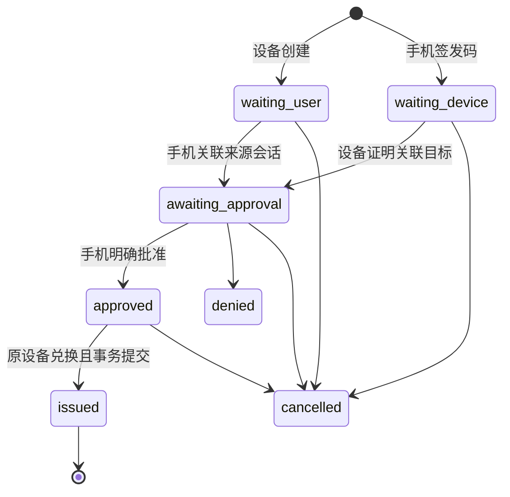

# 通用扫码授权设备登录技术设计

日期：2026-10-08。状态：设计与分期实施中，安全基础切片已实现，扫码登录流程尚未接通。设计代码核对基线：`1ca4d17`。除第 22 节列出的已实现内容外，新增服务、路由和表均为待实现契约；现有能力见第 3 节。

本设计为已登记设备提供两种人员登录方式：手机扫描设备显示码，以及设备扫描手机出示码。两种方式均由手机上的已认证人员确认具体目标设备，再为目标设备签发独立的人员设备会话。设备后续使用现有 refresh、注销、设备会话认证及业务授权体系。

能力面向可嵌入 IDP 的不同宿主。IDP 管理身份、设备证明、授权请求、会话和安全审计；宿主管理业务准入、设备业务资料和交互。SMT 的工厂、工位和权限要求作为接入映射示例，不进入通用身份模型。

## 1 目标与首期范围

首期必须交付：

- `device_display`：目标设备显示动态二维码，手机扫描并确认。
- `phone_display`：手机出示一次性码，目标设备扫描，手机确认已关联的具体设备。
- 同客户端和显式允许的跨客户端授权；普通业务人员可使用，不要求管理权限。
- 服务端宿主准入扩展点，覆盖创建、关联、查看确认资料、批准、兑换及结果交付。
- 原设备查询、幂等兑换、响应丢失恢复、接收确认、精确撤销和到期清理。
- 固定 Rust/HTTP 契约、设备证明格式、合成测试向量、迁移与接入示例、并发及故障验收。

传统账号密码设备登录继续走现有证明登录接口。它与两种扫码方式最终产生相同用途的人员设备会话。宿主若统一控制三种登录方式，应在传统登录适配层应用同一业务准入策略，不能通过新增扫码模块自动获得传统入口的业务检查。

首期不提供免确认扫码、离线签发、静态员工身份码登录、跨租户转授权或通用 OAuth token exchange。设备登记和密钥恢复仍走现有生命周期接口。RFC 8628 可作为设备显示码方向的交互参考；本设计的双向流程、设备证明和恢复接口属于模块专用协议，不宣称实现标准 OAuth Device Authorization Grant。[RFC 8628](https://www.rfc-editor.org/rfc/rfc8628.html)

## 2 通用边界与固定安全规则

| IDP 固定规则 | 宿主注入的规则或资料 |
| --- | --- |
| 有效业务人员身份、租户成员关系、来源会话 | 人员业务资格、岗位、班次等 |
| 已登记且有效的设备、当前密钥和私钥证明 | 设备是否属于业务、场所或工厂，是否允许作业 |
| 来源客户端至目标客户端的允许关系 | 应用部署配置和登录方式开关 |
| 手机确认精确目标设备、不可变的授权对象 | 设备显示名称、识别码和必要的场所提示 |
| 一次授权最多一个新会话、一次性挑战 | 是否限制单台终端只保留一个人员会话 |
| 凭据保护、恢复期限、幂等与精确撤销 | 界面、扫码枪、码牌、通知、业务审计关联 |

设备身份、人员设备关系、会话及扫码授权表不增加 `business_id`、工厂或工位字段。通用 `host_scope` 是服务端配置的接入隔离标识，IDP 只做精确比较，不解析业务意义；它不是设备归属或人员权限。

用户标识只能来自 IDP 验证的来源会话。目标设备标识必须与有效设备证明一致。客户端传来的租户、入口、请求 ID 均是待核对的定位参数，不构成授权。不能仅凭客户端提交的 `approved=true`、`account_id`、工位名或设备编号签发会话。

设备码、手机码均不包含 access token、refresh token、密码或长期身份凭据。手机永远不收到目标设备的令牌。最终会话绑定目标设备，不绑定手机设备。

## 3 当前能力与增量

| 当前实现 | 本次复用或补齐 |
| --- | --- |
| `TenantDeviceAuthenticationService::login_proven/select_proven` | 复用设备、密钥、人员设备关系和会话不变量，新增扫码授权作为人员认证来源 |
| `AuthenticatedDeviceSession` 与 `authenticate_device` | 结果继续包含可信 tenant、subject、session、device；不从请求头补设备身份 |
| `BrowserSessionService` 的 Cookie 登录、恢复、刷新、注销 | 新增不轮换 refresh 的业务 Cookie 身份读取契约及扫码浏览器路由 |
| `CoreTenantDeviceProofService` 的一次性挑战与请求验签 | 新增专用扫码用途和签名上下文，不借用 `client_sync_transport` |
| `TenantDeviceAdmission` 的设备登记准入 | 参考其可信上下文边界，新增专用于扫码登录的阶段契约，不扩大登记接口职责 |
| 会话和 refresh 同事务创建，数据库只存 refresh 摘要 | 新增短期加密结果保存及交付确认，普通 refresh 表仍只存摘要 |
| 精确 refresh family 撤销与管理端会话撤销 | 增加业务用途、幂等、按扫码操作限定的撤销入口，不冒用管理身份 |
| 已签发会话可立即通过业务认证 | 扫码新会话增加交付确认门禁；确认前禁止业务使用和 refresh，确认后沿用现有规则 |

源码入口：[认证服务](../crates/embedded-idp-core/src/access/authentication.rs)、[设备认证](../crates/embedded-idp-core/src/access/authentication/device_transport.rs)、[设备证明](../crates/embedded-idp-core/src/access/device_proof.rs)、[浏览器适配](../crates/embedded-idp-axum/src/browser_session.rs)。现有设备生命周期规则继续遵循[设备身份设计](device-identity-lifecycle-design-v1.md)和[生产安全要求](rust-embedded-idp-production-security-delivery-v2.md)。

## 4 概念与凭据

| 名称 | 用途与保护 |
| --- | --- |
| `grant_id` | 服务端生成的 canonical UUID，定位授权记录；知道它不获得读取或操作权限 |
| `operation_id` | 调用方在发送前生成并保存的 canonical UUID；同一动作重试保持不变；不是秘密 |
| `display_code` | 设备二维码内的 `D1.` 加 32 随机字节的无填充 base64url；只用于手机关联 |
| `scan_code` | 手机二维码或条形码内的 `P1.` 加 16 随机字节的无填充 base64url；只能关联目标设备，不能直接兑换会话 |
| `delivery_secret` | 原生层在创建设备请求或关联手机码前生成的 32 随机字节；先持久保存再发送，绝不显示为码 |
| `delivery_secret_hash` | SHA-256(secret 原始 32 字节)，无填充 base64url；与设备证明一起在创建／关联时固定 |
| `confirmation_revision` | 将来源会话、目标设备及其安全版本、宿主显示资料版本绑定到一次手机确认；不是身份凭据 |
| `issuance_operation_id` | 本次兑换的固定 operation ID，与唯一新会话关联 |
| `receipt_nonce` | 随初始令牌结果返回的 32 随机字节；设备用它确认确已拿到结果 |

所有随机秘密使用密码学随机源。二维码与条形码只是编码载体；IDP 返回码文本，不生成图形。手机码建议采用扫描器可识别的 ASCII 编码，禁止为了缩短条形码把随机强度降低到工号或短数字 PIN。

设备二维码可使用受配置限制的 HTTPS H5 地址与 fragment，例如 `https://login.example.test/device#code=D1.…`。H5 读取后立即移除 fragment，把码作为 POST JSON 提交。不能把码放在查询日志、分析埋点或 Referrer 中；登录页禁止第三方追踪。宿主自行保证跳转到登录后保留待处理码的短期内存上下文。

固定设备贴纸只能定位目标；宿主必须找到该设备新鲜证明创建的唯一活动请求，并让手机确认。首期标准流程使用动态码，不把贴纸编号作为授权凭据。

## 5 客户端与租户关系

来源是普通业务人员客户端，目标是已登记设备所属客户端。每个扫码入口由服务端解析为以下固定配置：

```rust
pub struct ScanLoginEntryConfig {
    pub entry_id: String,
    pub target_client_id: String,
    pub allowed_source_client_ids: Vec<String>,
    pub host_scope: String,
    pub tenant_policy: LoginTenantPolicy,
    pub modes: Vec<ScanLoginMode>,
    pub target_scope: Option<String>,
    pub limits: ScanLoginLimits,
}
```

`verification_uri` 和 `proof_audience` 属于可信 HTTP 适配配置，不进入无 HTTP 依赖的 Core 入口配置。Core 已实现该入口配置及期限、来源关系、scope 的校验；实际服务仍必须检查有效身份、客户端存在性、设备证明和宿主业务准入。

同客户端也要显式列入允许集合，不默认允许任意同名客户端扫码登录。跨客户端必须配置有方向的允许关系，例如 `employee-mobile -> workstation-native`；反向关系不会自动产生。来源必须为 Business 用途，Management 令牌或 Cookie 不能批准。

授权请求固定一个业务租户。Enabled 模式下用户必须先在手机完成该租户的普通业务登录；租户选择票据不能批准。Disabled 模式使用业务域 `0`。跨租户请求拒绝，用户切换手机租户后需要重新创建或关联请求，不能改写已有 grant 的租户。

目标会话的权限范围由目标入口策略确定，并受人员现有权限约束。不会复制手机 token 的 scope，更不能让手机指定任意 target scope、audience 或令牌有效期。`authenticated_at` 保留来源认证时间，不因扫码而声称用户刚完成密码或 MFA 验证；宿主可以要求来源认证足够新。

IDP 身份租户与业务工厂是独立概念。SMT 可在一个身份租户内管理多个工厂，准入适配器负责映射及验证。

## 6 状态与期限

授权状态与交付状态分开记录：



`waiting_user/waiting_device/awaiting_approval/approved` 均可进入 `expired` 或 `invalidated`。`denied/cancelled/expired/invalidated` 不可恢复为待授权。`issued` 表示授权已消费，其交付记录继续流转：

| 交付状态 | 含义 |
| --- | --- |
| `recoverable` | 唯一会话已创建，初始结果可在期限内经准入恢复；不能据此推断客户端未收到 |
| `acknowledged` | 原设备提交正确 receipt nonce，确认接收；加密令牌结果已删除 |
| `revoked` | 本次会话已被精确撤销，结果已删除；授权记录仍保留签发事实 |

不记录具有误导性的 `delivered=true`：写出 HTTP 响应不能证明接收。`acknowledged` 只证明客户端完成协议确认，不证明用户开始业务操作。

建议默认值及服务端硬上限：

| 参数 | 默认 | 上限或约束 |
| --- | --- | --- |
| 设备显示码与 grant 总有效期 | 180 秒 | 600 秒 |
| 手机码等待设备扫描时间 | 60 秒 | 120 秒 |
| 手机发起 grant 总有效期 | 180 秒 | 600 秒；关联不延长总期限 |
| 已批准待兑换 | 60 秒 | 不超过 grant 总期限 |
| 结果恢复窗口 | 120 秒 | 300 秒且早于初始 access token 到期 |
| 设备挑战 | 60 秒 | 沿用挑战配置的有效期和时钟偏差约束 |
| 状态轮询 | 2 秒 | 返回 `poll_after_ms`；限流后按 `Retry-After` 退避 |
| 宿主准入决定可用时间 | 最长 5 秒 | 每次动作重新判定；不是可缓存的授权许可证 |

手机码关联后立即失去再次关联资格；同原操作重试返回原关联。所有过期以服务端时间为准，事务等待后重新判断。查询时即时计算过期状态，安全性不依赖清理任务及时执行。

## 7 两种完整交互

### 7.1 手机扫描设备显示码

1. 原生层生成并安全保存 create operation ID 和 delivery secret；获取 `scan_login_create` 挑战并签名。
2. IDP 验证设备、入口、租户及宿主创建准入，建立 `waiting_user`，返回 grant、display code、期限和轮询间隔。创建响应丢失时按原操作查询，恢复同一码而不创建新 grant。
3. 手机先完成普通业务登录，POST display code 与预期手机会话标识。IDP 验证来源客户端关系及宿主关联准入，原子绑定来源 account/session，进入 `awaiting_approval`。
4. H5 显示当前人员、宿主提供的目标名称、设备识别信息和匹配提示。关联码被消费，其他来源会话不能接管。误关联可拒绝并重建。
5. 手机提交明确批准与 confirmation revision。资料或安全版本变化时要求重新展示；不能静默批准变化后的目标。
6. 原设备查询到 approved 后，以新 proof、delivery secret 和固定 exchange operation ID 兑换。
7. IDP 事务生成唯一设备会话、初始 token bundle、加密恢复结果和审计。最终交付准入通过后返回 bundle。
8. 原生层先原子保存 bundle 和 receipt nonce，再发送接收确认；确认成功或核对到 acknowledged 后进入业务界面。

### 7.2 设备扫描手机出示码

1. 手机使用有效业务 Cookie，提交固定 operation ID 和目标入口；IDP 验证来源身份、入口关系及宿主准入，建立 `waiting_device`，返回 scan code。
2. 原生层扫描后生成并保存 claim operation ID 和 delivery secret，携带 `scan_login_claim` 证明提交 scan code。
3. IDP 验证目标设备、宿主准入和来源会话仍有效，原子固定目标 device/key/version，进入 `awaiting_approval`。两台设备竞争时仅一台成功。
4. 手机轮询到已关联设备，显示当前人员、真实目标名称和设备识别信息。用户拒绝时终结该请求；不允许把同一手机码转给第二台设备。
5. 用户批准后，执行与模式一完全相同的兑换、交付、恢复和确认流程。

设备在等待批准时只显示必要状态。预授权阶段不向未关联设备暴露人员资料；原设备需要显示人员时仅返回经配置允许的最小投影。SMT 的退出码牌在桌面触发现有当前会话注销，不进入扫码登录协议。

## 8 宿主准入与确认资料

### 8.1 类型和阶段

```rust
pub enum ScanAdmissionStage {
    CreateDevice, IssuePhoneCode, AttachSource, ClaimTarget,
    InspectConfirmation, Approve, Exchange, ReleaseResult, ActivateSession,
}
pub struct ScanAdmissionRequest {
    pub stage: ScanAdmissionStage,
    pub host_scope: String,
    pub entry_id: String,
    pub tenant_id: String,
    pub mode: ScanLoginMode,
    pub source: Option<ScanSourceReference>,
    pub target: Option<ScanTargetReference>,
    pub grant_id: Option<String>,
    pub operation_id: Option<String>, // 只读动作可为空；另用请求关联 ID 诊断
    pub request_fingerprint: [u8; 32],
}
// Rust 可信组合输入，无 Deserialize；不接受裸 HTTP header 直接转换。
pub struct TrustedScanHostContext { /* 私有 scope 和有效期；只允许服务端组合，无 Deserialize */ }
pub enum ScanAdmissionDecision {
    Allow { decision_id: String, policy_revision: String, valid_until: SystemTime },
    Deny { reason: String },
}
pub trait ScanLoginAdmission: Send + Sync {
    fn authorize(&self, request: &ScanAdmissionRequest,
        context: &TrustedScanHostContext)
        -> Result<ScanAdmissionDecision, ScanLoginError>;
}
pub trait ScanTargetPresentationProvider: Send + Sync {
    fn describe(&self, request: &ScanAdmissionRequest,
        context: &TrustedScanHostContext)
        -> Result<ScanTargetPresentation, ScanLoginError>;
}
pub struct ScanTargetPresentation {
    pub display_name: String,       // 纯文本，1 至 128 字符
    pub identification: String,     // 纯文本，1 至 128 字符
    pub context_label: Option<String>, // 例如场所，最多 128 字符
    pub revision: String,
}
```

允许决定由 Core 在本次调用内部消费，绑定 stage、全部已知身份、操作摘要和有效期，不作为客户端可携带票据。没有提供准入适配器时，构建失败；简单宿主可以显式注入 `IdentityOnlyScanAdmission`，它仅增加入口方式开关检查，所有 IDP 身份规则仍执行。参考应用不得默认为任何设备、人员允许生产业务登录。

| 阶段 | 已知身份 | 典型宿主检查 |
| --- | --- | --- |
| 创建设备请求 | 目标租户、客户端、设备 | 方式开关、设备归属和运行状态 |
| 签发手机码 | 来源人员、会话、目标入口 | 方式开关、人员业务访问资格 |
| 关联来源或目标 | 来源与目标均已确定 | 组合资格、设备业务范围、登录权限 |
| 查看确认资料 | 已关联来源和目标 | 当前人员可查看该设备；返回真实显示资料 |
| 批准 | 来源与目标及确认版本 | 方式开关、最新资格、目标与显示版本 |
| 兑换 | 批准记录、来源与目标 | 最新资格和权限；不依赖过去的允许决定 |
| 交付或恢复结果 | 已签发目标会话、原设备 | 当前交付资格；不再要求来源手机会话有效 |
| 接收确认并激活 | 已释放结果的 Pending 会话、原设备及 receipt nonce | 最新业务准入；宿主需要时核对本地终端会话记录，不再要求来源手机会话有效 |

拒绝、取消、核对撤销和精确撤销必须验证各自调用者权限，但不受“允许新登录”的开关阻止。接收确认仅允许已通过一次 ReleaseResult 并取得 nonce 的原设备，并通过 ActivateSession 的当前业务检查。已经签发并释放结果后的确认不因登录方式开关单独拒绝；宿主可因人员资格、设备作业状态等当前条件拒绝激活并撤销 Pending。已 acknowledged 的重复确认直接返回成功元数据，不再次激活或执行新准入。

### 8.2 调用顺序与一致性

Core 对每个动作执行：短事务读取并验证身份和对象快照 → 结束事务 → 调用宿主准入和必要的显示资料接口 → 新事务按既定锁序复查身份、版本、期限、操作摘要 → 执行状态变更。设备证明在最终事务中重新验证并消费；前置校验不消费挑战。快照变化时拒绝或有限次重新准备，不能带旧准入决定执行新目标。

宿主外部查询不得在 IDP 行锁持有期间执行。宿主适配器不能写入 grant 或修改 IDP 会话；也不能在判定过程中先消费自己的业务票据。涉及宿主自身状态提交时，由宿主组织本地事务和补偿。

ReleaseResult 和 ActivateSession 的关联键固定为 grant_id 与 issuance_operation_id；查询判定必须可重复、无消费性副作用，不能使用“只能判定一次”的外部票据。每次恢复重新检查当前策略，不永久缓存首次 Allow。策略未变化时重复判定应一致；策略真实变化导致 Deny 是有效的新决定，必须拒绝交付并补偿，而不是为了幂等强行沿用旧 Allow。宿主若维护本地交付记录，按该关联键幂等维护。

两套数据库不提供跨库原子承诺。准入决定反映其判定时点的宿主状态，IDP 检查决定未过期；每次令牌交付必须再次判定。若宿主要求“关闭开关接口返回后绝不再释放在途结果”，宿主需把最终交付与关闭操作放入自身的短期准入协调机制，并在关闭成功返回前等待已准许的交付结束。不能只靠 5 秒 permit TTL 声称即时生效，也不需要长期跨库持锁。

业务请求继续实时授权。扫码登录不能冻结之后的业务资格，也不能替代库存、生产等接口自己的授权检查。

### 8.3 确认资料的真实性

设备名称由经过认证的 host scope 对应的资料提供者返回。客户端提交的名称不参与显示或授权。手机显示来源人员时以 IDP 当前身份投影为准；显示目标时同时展示设备识别信息，避免仅凭可重复的名称确认。

Core 将来源 account/session、target device、device/key version、资料 revision 和 grant version 固定在确认 revision 中。批准必须携带展示时的 revision，服务端重新读取并核对。变化返回 `confirmation_changed`，H5 重新显示后要求用户再次确认。显示资料是纯文本，长度受限，不能携带 HTML、脚本或任意跳转地址。

## 9 来源手机会话与 Cookie 适配

新增业务用途的只读 `BrowserSessionIdentityService`：

```rust
pub trait BrowserSessionIdentityService: Send + Sync {
    fn authenticate_browser(&self, cookie: SecretString,
        expected: Option<BrowserSessionIdentity>)
        -> Result<AuthenticatedBrowserSession, TenantAuthError>;
}
// AuthenticatedBrowserSession 的字段是私有的，只提供只读 getters：
// tenant_id/account_id/session_id/client_id/authenticated_at/expires_at。
// 不提供 HTTP Deserialize 或公开身份构造器。
```

扫码服务在验证入口关系后，从此可信身份建立内部 ScanSourceReference 引用；不能由浏览器填写该引用。身份结果的 expires_at 取当前 refresh 与 session 的最小到期时间，后续签发事务仍复查来源会话，而不把读取结果当作永久授权。

该服务验证 Cookie 内当前 refresh 凭据、会话、账号、成员、客户端、用途、期限及现有安全关系，但不轮换 refresh，不产生新 access token，不因为轮询增加认证凭据。旧 Cookie 与并发 refresh 竞争时返回需要重新读取身份的错误，不在只读接口触发 refresh 重用撤销；真正的 refresh 重用检测保持原规则。

浏览器首次调用 context 可省略 expected；之后 attach、issue、inspect、approve、deny、cancel、status 必须传 `expected_session`。它是防止串账号的断言，不能代替 Cookie。服务端从当前 Cookie 取得实际身份，再比较 tenant/account/session/client。不同来源会话即使属于同一账号，也不能接管已有授权。

路由放在 `/auth/browser/device-scan`，确保在当前业务 Cookie 的 Path 范围内；继续使用 HttpOnly、Secure、SameSite、精确 Origin、自定义请求头和 JSON 内容类型校验。管理 Cookie 不参与。H5 与这些 API 首期同源，宿主以反向代理或同源挂载实现；独立部署不意味开放跨域凭证 CORS。

为了其他宿主的原生手机客户端，Core 接受由来源客户端的业务认证服务构造的同一身份类型；HTTP Bearer 适配可另行组合，但不能让目标客户端认证服务直接接受另一客户端 token。首期交付至少含 H5 Cookie 适配，Bearer 适配不成为 SMT 首期前提。

批准和签发事务均复查来源会话。签发事务提交后，目标会话与来源独立；恢复、确认和目标 refresh 不再检查来源手机是否在线或已注销。账号停用、目标租户成员失效等共享身份规则仍继续作用于目标会话。

## 10 Rust 服务契约

以下类型对应已编译的公共 API；完整定义见 [Core model.rs](../crates/embedded-idp-core/src/access/scan_login/model.rs)。标识类型实施时复用现有验证器；秘密使用 `SecretString`，不得派生会泄漏内容的 Debug/Serialize。HTTP DTO 与可信 Core 参数分别定义。

```rust
pub enum ScanLoginMode { DeviceDisplay, PhoneDisplay }
pub struct ScanDeviceCall {
    pub entry_id: String,              // 路由解析并核对的目标入口
    pub proof: DeviceProofPresentation,
    pub binding: DeviceRequestBinding, // 宿主从实际请求重建
    pub host: TrustedScanHostContext,
}
pub struct ScanSourceCall {
    pub source: AuthenticatedBrowserSession, // 认证服务产生
    pub host: TrustedScanHostContext,
}
pub struct CreateDeviceScan {
    pub operation_id: String,
    pub entry_id: String,
    pub tenant_id: String,             // 必须与可信路由及证明核对
    pub delivery_secret_hash: [u8; 32],
}
pub struct IssuePhoneScan { pub operation_id: String, pub entry_id: String }
pub struct AttachScanSource { pub operation_id: String, pub display_code: SecretString }
pub struct ClaimScanTarget {
    pub operation_id: String,
    pub entry_id: String,
    pub tenant_id: String,
    pub scan_code: SecretString,
    pub delivery_secret_hash: [u8; 32],
}
pub struct SourceGrantAction { pub operation_id: String, pub grant_id: String }
pub struct ApproveScan { pub action: SourceGrantAction, pub confirmation_revision: String }
pub struct DeviceGrantAccess { pub grant_id: String, pub delivery_secret: SecretString }
pub struct ExchangeScan { pub operation_id: String, pub access: DeviceGrantAccess }
pub struct RecoverScan { pub issuance_operation_id: String, pub access: DeviceGrantAccess }
pub struct AcknowledgeScan {
    pub operation_id: String, pub issuance_operation_id: String,
    pub access: DeviceGrantAccess, pub receipt_nonce: SecretString,
}
pub struct CancelDeviceScan { pub operation_id: String, pub access: DeviceGrantAccess }
pub struct AbortScanDelivery {
    pub operation_id: String, pub issuance_operation_id: String,
    pub access: DeviceGrantAccess,
}
pub struct LookupDeviceScan {
    pub origin_operation_id: String, pub entry_id: String,
    pub tenant_id: String, pub delivery_secret: SecretString,
}
pub trait TenantDeviceScanLoginService: Send + Sync {
    fn entry_config(&self) -> ScanLoginEntryConfig;
    fn device_status(&self, c: DeviceGrantAccess, actor: ScanDeviceCall)
        -> Result<ScanProgress, ScanLoginError>;
    fn create_device(&self, c: CreateDeviceScan, actor: ScanDeviceCall)
        -> Result<CreatedDeviceScan, ScanLoginError>;
    fn issue_phone(&self, c: IssuePhoneScan, actor: ScanSourceCall)
        -> Result<IssuedPhoneScan, ScanLoginError>;
    fn attach_source(&self, c: AttachScanSource, actor: ScanSourceCall)
        -> Result<ScanConfirmation, ScanLoginError>;
    fn claim_target(&self, c: ClaimScanTarget, actor: ScanDeviceCall)
        -> Result<ScanProgress, ScanLoginError>;
    fn inspect(&self, grant_id: String, actor: ScanSourceCall)
        -> Result<ScanConfirmation, ScanLoginError>;
    fn approve(&self, c: ApproveScan, actor: ScanSourceCall)
        -> Result<ScanProgress, ScanLoginError>;
    fn deny(&self, c: SourceGrantAction, actor: ScanSourceCall)
        -> Result<ScanProgress, ScanLoginError>;
    fn cancel_source(&self, c: SourceGrantAction, actor: ScanSourceCall)
        -> Result<ScanProgress, ScanLoginError>;
    fn cancel_device(&self, c: CancelDeviceScan, actor: ScanDeviceCall)
        -> Result<ScanProgress, ScanLoginError>;
    fn source_status(&self, grant_id: String, actor: ScanSourceCall)
        -> Result<ScanProgress, ScanLoginError>;
    fn device_status(&self, c: DeviceGrantAccess, actor: ScanDeviceCall)
        -> Result<ScanProgress, ScanLoginError>;
    fn lookup_device(&self, c: LookupDeviceScan, actor: ScanDeviceCall)
        -> Result<DeviceScanLookup, ScanLoginError>;
    fn exchange(&self, c: ExchangeScan, actor: ScanDeviceCall)
        -> Result<ScanDeliveryResult, ScanLoginError>;
    fn recover(&self, c: RecoverScan, actor: ScanDeviceCall)
        -> Result<ScanDeliveryResult, ScanLoginError>;
    fn acknowledge(&self, c: AcknowledgeScan, actor: ScanDeviceCall)
        -> Result<ScanProgress, ScanLoginError>;
    fn abort_delivery(&self, c: AbortScanDelivery, actor: ScanDeviceCall)
        -> Result<ScanProgress, ScanLoginError>;
    fn compensate(&self, host: TrustedScanHostContext, grant_id: String,
        issuance_operation_id: String, operation_id: String) -> Result<ScanProgress, ScanLoginError>;
    fn cleanup(&self, host: TrustedScanHostContext, limit: u32) -> Result<u32, ScanLoginError>;
}
```

服务在构造时注入 store、clock、ID/secret generator、设备验签、目标 token issuer、结果加密器、入口配置、准入和显示资料提供者。使用当前同步 Core 风格，Axum 按已有方式隔离阻塞执行；不得在事务中等待宿主网络调用。

`ScanProgress` 包含 grant/mode/state/delivery_state、version、各适用期限、poll_after_ms、server_time、允许的下一步动作；没有 token 或原始码。`ScanConfirmation` 在进度上增加当前人员投影、目标身份投影、可信显示资料、confirmation_revision。`CreatedDeviceScan/IssuedPhoneScan` 额外包含各自展示码。`ScanDeliveryResult` 仅在合法兑换／恢复响应里包含 `TenantLoginSession`、receipt_nonce、恢复期限与 issuance_operation_id。

同一服务提供服务端 `compensate(trusted_host, grant_id, issuance_operation_id, operation_id)`，以及批量有界 cleanup。它只能在匹配的 host scope 下撤销该 grant 创建且尚未 acknowledged 的会话，不能接收任意 session ID；无公开匿名路由。已 acknowledged 返回 `already_acknowledged`，宿主若要强制撤销正常会话必须使用已有且另行授权的会话管理能力。

## 11 HTTP 契约

### 11.1 通用规则

模块保留 `/auth` 与 `/devices` 路由根，宿主选择外层前缀。下表为模块路径，设备签名中的 path 必须包含实际外层前缀。请求均为 JSON POST，最大 16 KiB，拒绝未知字段和重复字段，响应 `Cache-Control: no-store`。所有时间是服务端 Unix 秒，grant 返回绝对到期时间和剩余秒数，手机码、批准和恢复窗口返回各自绝对到期时间。

源端请求通过 Cookie 与浏览器保护校验；目标端请求通过第 12 节设备证明。设备端每个请求体包含 `tenant_id`；create、claim、lookup 额外包含 `entry_id`，其他动作的 entry 由可信路由配置确定。tenant_id 是签名中的租户断言，Core 必须在该租户内验证设备、密钥、绑定和挑战归属，不能凭 JSON 断言建立身份。表中的 `access` 表示展开在 JSON 顶层的 `grant_id` 和 `delivery_secret`，不是嵌套字段。

| 路由 | 请求体的其他字段 | 成功响应 |
| --- | --- | --- |
| `/auth/browser/device-scan/context` | 可选 expected_session | 200 当前来源身份、可用入口和方式 |
| `/auth/browser/device-scan/phone-codes` | operation_id、entry_id、expected_session | 201（含相同操作的幂等重试），grant、scan_code、期限 |
| `/auth/browser/device-scan/attach` | operation_id、display_code、expected_session | 200 confirmation |
| `/auth/browser/device-scan/inspect` | grant_id、expected_session | 200 confirmation |
| `/auth/browser/device-scan/approve` | operation_id、grant_id、confirmation_revision、expected_session | 200 progress |
| `/auth/browser/device-scan/deny` | operation_id、grant_id、expected_session | 200 progress |
| `/auth/browser/device-scan/cancel` | operation_id、grant_id、expected_session | 200 progress |
| `/auth/browser/device-scan/status` | grant_id、expected_session | 200 progress |
| `/auth/device-scan/create` | operation_id、delivery_secret_hash | 201（含相同操作的幂等重试），grant、display_code、verification_uri、期限 |
| `/auth/device-scan/claim` | operation_id、scan_code、delivery_secret_hash | 200 progress |
| `/auth/device-scan/status` | access | 200 progress |
| `/auth/device-scan/lookup` | origin_operation_id、delivery_secret | 200 创建／关联结果；只有创建者可恢复尚未消费的 display_code |
| `/auth/device-scan/cancel` | operation_id、access | 200 progress |
| `/auth/device-scan/exchange` | operation_id、access | 200 delivery result；未批准为 409 |
| `/auth/device-scan/recover` | issuance_operation_id、access | 200 同一 delivery result；已确认仅返回 progress |
| `/auth/device-scan/acknowledge` | operation_id、issuance_operation_id、access、receipt_nonce | 200 progress |
| `/auth/device-scan/abort` | operation_id、issuance_operation_id、access | 200 revoked 或幂等终态 |
| `/devices/proof/challenges` | tenant_id、device_id、purpose | 200 challenge、expires_at_unix_secs |

设备创建及关联前没有人员会话，不要求 Bearer。取得 challenge 本身不授予任何权限；沿用未知／无资格设备的不可枚举挑战响应。手机码和 display code 必须通过已认证 actor 才可解析，错误码不得形成公开设备或人员目录。

### 11.2 请求与响应示例

返回类型的固定字段如下。可空字段使用显式 `null`，不根据结果任意省略；模式专属秘密只出现在有权限的创建／原操作恢复响应中。

| 投影 | 字段 |
| --- | --- |
| `ScanProgress` | grant_id、mode、state、version、server_time_unix_secs、expires_at_unix_secs、code_expires_at_unix_secs、approved_until_unix_secs(null或秒)、expires_in、poll_after_ms、delivery_state(null/recoverable/acknowledged/revoked)、issuance_operation_id(null或UUID)、recover_until_unix_secs(null或秒)、next_action |
| `ScanConfirmation` | progress、source(account_id/session_id/client_id/display_name)、target(device_id/display_name/identification/context_label/revision)、confirmation_revision |
| `CreatedDeviceScan` | progress 对象、display_code、verification_uri |
| `IssuedPhoneScan` | progress 对象、scan_code、code_expires_at_unix_secs |
| `DeviceScanLookup` | progress、origin_operation_id、display_code(null或仍可显示的原码)；不包含令牌 |
| `ScanDeliveryResult` | progress 对象；可交付时额外含 session、tokens、receipt_nonce；已确认恢复只含 progress |

`next_action` 取 `wait_for_phone_scan`、`wait_for_device_scan`、`confirm_on_phone`、`exchange`、`persist_then_acknowledge`、`use_local_session`、`restart` 中之一；只表示协议下一步，由客户端结合自身角色显示操作。不可继续轮询时 poll_after_ms 为 0。`expires_in` 固定表示 grant 授权期限剩余秒数，最小 0；issued 后恢复期限以 recover_until 为准。

phone-code 返回的 progress.target 不存在：公共 progress 本身不携带身份；只有关联后的 confirmation 含目标和来源投影。手机 status 可获同一 progress，但不返回原设备的 delivery secret、receipt nonce 或任何目标 token。源端返回 issuance_operation_id 仅用于关联诊断，不授予领取权限。

创建请求中的 secret hash 来自原生层预先保存的秘密，示例占位值不是真实凭据：

```json
{
  "operation_id": "11111111-1111-4111-8111-111111111111",
  "entry_id": "terminal-login",
  "tenant_id": "tenant-a",
  "delivery_secret_hash": "<43-char-base64url-sha256>"
}
```

```json
{
  "progress": {
    "grant_id": "22222222-2222-4222-8222-222222222222",
    "mode": "device_display",
    "state": "waiting_user",
    "version": 1,
    "delivery_state": null,
    "issuance_operation_id": null,
    "recover_until_unix_secs": null,
    "next_action": "wait_for_phone_scan",
    "server_time_unix_secs": 1791417600,
    "expires_at_unix_secs": 1791417780,
    "expires_in": 180,
    "poll_after_ms": 2000,
    "code_expires_at_unix_secs": 1791417780,
    "approved_until_unix_secs": null
  },
  "display_code": "D1.<43-char-base64url>",
  "verification_uri": "https://login.example.test/device"
}
```

手机批准请求：

```json
{
  "operation_id": "33333333-3333-4333-8333-333333333333",
  "grant_id": "22222222-2222-4222-8222-222222222222",
  "confirmation_revision": "<opaque-revision>",
  "expected_session": {
    "tenant_id": "tenant-a",
    "account_id": "44444444-4444-4444-8444-444444444444",
    "session_id": "55555555-5555-4555-8555-555555555555",
    "client_id": "employee-mobile"
  }
}
```

兑换或恢复响应：

```json
{
  "progress": {
    "grant_id": "22222222-2222-4222-8222-222222222222",
    "issuance_operation_id": "66666666-6666-4666-8666-666666666666",
    "state": "issued",
    "delivery_state": "recoverable",
    "recover_until_unix_secs": 1791417720,
    "server_time_unix_secs": 1791417600,
    "next_action": "persist_then_acknowledge",
    "mode": "device_display",
    "version": 4,
    "expires_at_unix_secs": 1791417780,
    "code_expires_at_unix_secs": 1791417780,
    "approved_until_unix_secs": 1791417660,
    "expires_in": 180,
    "poll_after_ms": 0
  },
  "session": {
    "tenant_id": "tenant-a",
    "client_id": "workstation-native",
    "expires_at_unix_secs": 1791446400,
    "session_id": "77777777-7777-4777-8777-777777777777",
    "account_id": "44444444-4444-4444-8444-444444444444"
  },
  "tokens": {
    "access_token": "<target-access-token>",
    "refresh_token": "<target-refresh-token>",
    "access_expires_at_unix_secs": 1791418500,
    "refresh_expires_at_unix_secs": 1791446400
  },
  "receipt_nonce": "<43-char-base64url>"
}
```

对上述 bundle 的 access/refresh 使用必须等待交付确认。恢复返回相同 session、令牌字节、receipt nonce 和初始有效期，只有 server_time、剩余时间等非秘密元数据更新。

### 11.3 错误码与可重试性

统一错误形状为 `{"error":"scan_expired","message":"…","request_id":null,"retryable":false}`；request_id 可由宿主可观测中间件填充；模块默认 null。message 仅供显示，程序按 error 处理。服务故障不能伪装成已退出或未签发。

| HTTP | error | 处理 |
| --- | --- | --- |
| 400 | `invalid_request` | 修正参数，不盲重试 |
| 401 | `invalid_source_session` | 手机重新读取身份或登录；原 grant 不转移到新会话 |
| 403 | `browser_origin_rejected` / `source_client_not_allowed` / `scan_host_context_required` | 配置或来源拒绝 |
| 403 | `device_proof_invalid` | 使用新挑战重建证明；不暴露设备存在性细节 |
| 403 | `scan_admission_denied` / `scan_mode_disabled` | 拒绝新授权或交付，返回安全原因分类 |
| 404 | `scan_not_found` | 不存在或不属于调用者，统一外部语义 |
| 409 | `browser_session_changed` | 清除旧确认界面，重新读取当前身份 |
| 409 | `scan_already_claimed` / `confirmation_changed` | 不改目标；刷新确认或新建流程 |
| 409 | `scan_not_approved` | 按 poll_after_ms 等待或读取终态 |
| 409 | `operation_conflict` | 同 operation ID 的语义内容不同；禁止自动换 ID 重试 |
| 409 | `exchange_already_started` | 原设备使用返回的原 issuance_operation_id 核对／恢复 |
| 409 | `scan_already_issued` | 取消不能回退签发；用明确的未交付撤销接口 |
| 409 | `already_acknowledged` | 仅撤销未交付结果等不再适用的动作返回；重复 ack 返回 200 acknowledged，recover 返回 200 无秘密元数据 |
| 410 | `scan_expired` / `scan_cancelled` / `scan_denied` / `scan_invalidated` | 终结本次流程 |
| 410 | `delivery_expired` / `delivery_revoked` | 清除本地待交付凭据并重新开始 |
| 429 | `scan_rate_limited` | 等待已有请求终结，并遵守宿主限流退避；不申请大量新挑战绕过限制 |
| 503 | `scan_admission_unavailable` / `scan_storage_unavailable` / `scan_result_unavailable` | 保留 operation ID，核对后重试；结果未知不等于失败 |

`status/lookup` 对有权调用者返回明确终态；动作端点返回对应错误。拒绝码不包含工厂、账号或密钥内部状态；细节放入受控审计。

## 12 设备证明协议与测试向量

使用现有 Ed25519、五个 `X-Device-*` 头、canonical base64url 和一次性 challenge。新增固定 profile `EMBEDDED-IDP-DEVICE-SCAN-V2`；每个路由由服务端固定 purpose：

| 动作 | purpose |
| --- | --- |
| create | `scan_login_create` |
| claim | `scan_login_claim` |
| status | `scan_login_status` |
| lookup | `scan_login_lookup` |
| cancel | `scan_login_cancel` |
| exchange | `scan_login_exchange` |
| recover | `scan_login_recover` |
| acknowledge | `scan_login_ack` |
| abort | `scan_login_abort` |

客户端先向现有 `/devices/proof/challenges` 申请相应用途的挑战；扩展设备认证服务的允许用途列表。签名验证必须在本次动作的身份事务内完成并原子消费 challenge。签名有效但原子动作失败时，根据事务结果回滚消费；调用者仍应获取新挑战重试。对取消、过期清理等需要提交状态的业务拒绝，用成功的事务结果枚举表示，再映射 HTTP 错误，不能通过 `Err` 意外回滚应提交的撤销。

签名字节为现有 `build_request_proof_bytes` 的结果，再追加扫码上下文摘要行：

```text
EMBEDDED-IDP-DEVICE-SCAN-V2\n
tenant-id:{trusted_tenant}\n
audience:{configured_audience}\n
method:POST\n
path:{actual_external_path}\n
body-sha256:{base64url_sha256_exact_raw_body}\n
challenge:{challenge}\n
device-id:{proven_device_id}\n
key-id:{canonical_jwk_thumbprint}\n
signed-at:{unix_seconds}\n
scan-context-sha256:{context_digest}\n
```

上面的 `\n` 表示一个 LF 字节，不是两个可见字符。必须有末尾 LF，不能使用 CRLF。body 摘要基于实际发送的 UTF-8 字节，不能解析 JSON 后重新序列化。path 不含 query/fragment，使用现有严格路径约束；代理前缀由可信配置确定。profile、audience、purpose 和目标客户端配置不可由证明头选择。

`context_digest = base64url(SHA256(prefix || part1 || part2 || part3))`。prefix 精确为 UTF-8 `EMBEDDED-IDP-SCAN-CONTEXT-V1\n`；三个 part 依次是固定 purpose、target_client_id、entry_id，每个 part 为 `u64 big-endian 字节长度 || UTF-8 字节`。它绑定不一定出现在 HTTP body 中的配置上下文，避免跨入口和跨用途挪用。operation ID、grant ID、码或 delivery secret 已由原始 body 摘要覆盖。

扫码动作不使用密码登录的 credential digest，也不修改已有证明签名字节。`client_sync_transport` 仍专用于无人员离线补传。手机批准不要求目标设备私钥；它通过业务来源会话、CSRF 防护和确认 revision 授权。

本设计附带[合成向量](fixtures/device-scan-login-v1.json)和 [Node 校验器](examples/verify-device-scan-login-vectors.mjs)，包含全部九种设备动作、实际 body 字节、JWK thumbprint、上下文摘要、canonical 文本、摘要和签名；seed 是公开测试数据，禁止生产使用。校验器独立重建字节、签名和篡改失败案例。实现阶段 Rust 与 SDK 必须读取同一 fixture 校验，不能各自生成一套自洽数据替代跨语言一致性测试。

## 13 兑换 交付 恢复与撤销

### 13.1 复用 Pending 会话

现有 `SessionStatus` 和 Postgres 已包含 Pending。扫码兑换事务创建 `Pending` 的 Business 人员设备会话、初始 refresh 摘要和 token bundle，grant 进入 issued，交付记录为 recoverable。不能先创建 Active 会话，再以第二个事务把它改 Pending。

Pending 会话即使令牌签名有效，也不能通过人员认证、设备会话认证、受保护设备请求、OIDC introspection、授权码签发、切租户或 refresh。对已验证属于本次扫码交付的调用可返回 `delivery_pending`，其他调用沿用安全的无效会话错误。接收确认走设备证明和交付秘密，不要求 Pending token 先成为有效人员会话。

原设备提交 receipt nonce，经过 ActivateSession 准入后，同事务执行 Pending→Active、delivery→acknowledged、清除加密 bundle、清除 nonce 摘要及追加审计。只接受该 grant/issuance/session 组合，不允许以此激活任意 Pending 会话。目标身份、设备及人员设备关系仍须有效；不再检查手机来源会话。首次确认把 nonce 纳入操作语义摘要；其摘要清理后，原设备的同一确认操作仍可凭原幂等记录返回 200 acknowledged，不要求找回已删除的 nonce。不同确认操作对已 acknowledged 结果也只返回安全元数据，不产生任何激活副作用。

对外 `delivery_confirmed` 是交付状态投影，不新增 session 布尔列。正常密码会话依旧直接 Active。扫码确认后复用现有 Active 会话认证与 refresh 路径，不增加长期扫码令牌格式。

所有资源服务器必须调用 IDP 的会话有效性校验或等价的有状态检查。只验证 JWT 签名的宿主不能满足 Pending 门禁或即时撤销契约，不属于此接入方案的安全验收范围。设备会话绑定也不能替代请求持有证明；需要限制令牌盗用的接口仍校验新鲜设备证明。[RFC 9700 第 4.10.1 节](https://www.rfc-editor.org/rfc/rfc9700.html#section-4.10.1)

### 13.2 兑换事务

在同一 IDP 事务内完成：

1. 按既定顺序锁定身份和相关对象，验证批准仍有效、来源会话仍 Active、来源与目标客户端关系仍允许。
2. 复查账号、成员、目标设备及当前 key、既有人设备关系；验证新的 exchange proof 与固定操作内容。
3. 无 active 关系时按现有首次登录规则创建新关系，绝不覆盖 suspended 或重新激活旧 unbound 行。
4. 创建唯一 Pending 设备会话、初始 refresh 摘要和初始 token bundle。
5. 在进程内加密 bundle 与 receipt nonce，把密文、key ID、唯一会话引用和恢复期限落库。
6. 消费挑战与 grant，记录幂等结果和审计，然后提交。

任一步骤失败，以上全部回滚，包括绑定、challenge、session、refresh、密文及审计。签名器／加密器必须是本地可用适配器；不能在持锁事务中调用远程 KMS 取密钥或网络签名。需要外部密钥系统时由宿主在事务外准备本地受保护句柄，并保证窗口内可用。

提交后执行 ReleaseResult 准入。Allow 后以短事务复查 Pending 会话、设备安全版本、精确绑定、交付期限及原操作，首次释放时记录 `release_authorized_at`，重试不重复记录同一成功事件，解密并返回同一结果。此时仍未 Active，原设备必须确认接收。

### 13.3 最终交付失败

| 情况 | 行为 |
| --- | --- |
| ReleaseResult 明确 Deny | 不返回秘密；精确撤销 Pending 会话与 refresh、delivery→revoked、删除密文并审计 |
| 宿主判定或网络暂时不可用 | 返回 503，保持 Pending/recoverable，原操作可重试，不擅自当成永久拒绝 |
| 拒绝已确定但撤销暂时落库失败 | 不交付；报告撤销结果未知。持久 Pending 记录本身是未完成任务，恢复必经新准入；宿主可持久重试补偿，IDP 到期清理兜底 |
| 进程在兑换提交后、准入前崩溃 | 恢复读取同一 Pending 结果，重新进行 ReleaseResult；不会重建会话 |
| 执行撤销时已经 acknowledged | 返回 already_acknowledged；不由过期的交付补偿撤销正常 Active 会话 |

首期应提供组合 coordinator，使通常的 `exchange/recover` 调用都自动经过 ReleaseResult。低层读取密文／解密函数不是公共 HTTP 路由。独立 IDP 部署时，宿主的可信服务端接入层必须实现相同的门禁；仅在前端隐藏 token 不构成拒绝交付。

ActivateSession 明确拒绝、临时不可用或补偿故障，采用与 ReleaseResult 相同的失败关闭和精确撤销规则；它不得因为收到了客户端的 receipt nonce 就跳过宿主最终准入。现有 Pending 门禁保证尚未激活的 token 无法在此期间执行业务。

IDP 的 Pending 门禁保证跨库失败不会放行未确认会话。宿主若还要提交本地“终端当前人员”记录，应在其服务端接收确认流程中检查并持久记录本地准入结果，再调用 IDP acknowledge；失败使用精确补偿。两边提交的顺序和短暂不一致仍须由宿主处理，不能称为跨库事务。宿主业务接口应同时验证本地终端会话映射和 IDP Active 状态。

### 13.4 恢复协议

原生层在发出 create/claim 前持久保存 origin operation ID、entry/tenant、delivery secret；收到 grant 后保存 grant ID，在兑换前保存 issuance operation ID。秘密使用平台安全存储，不能存入 Web localStorage、普通日志或二维码。原生层负责私钥签名与 token 保存，WebView 只得到状态和必要身份投影。

恢复顺序：

1. 不知道 grant ID：凭 origin operation ID、新 proof 和 delivery secret 调用 lookup。
2. 知道 grant ID 但不知是否签发：调用 status；若 issued，获取原 issuance operation ID 和交付状态。
3. recoverable：用新 challenge/proof、原 issuance operation ID 和 delivery secret 调用 recover。通过最新准入后返回完全相同的初始 bundle。
4. 原生层原子持久保存 bundle 与 receipt nonce，再 acknowledge。确认响应丢失时重复确认或 status；acknowledged 表示可使用本地 bundle。
5. acknowledged：服务端不再返回秘密。若设备此时丢失本地 bundle，必须正常重新登录；不能恢复已经轮换过的初始 refresh。
6. revoked／过期：清除本地待交付结果，重新创建流程。不能用原 grant 创建第二个会话。

Pending 状态禁止 refresh，因此恢复窗口内初始 refresh 不会被正常轮换。ack 与 recover 并发时按交付锁顺序串行化：ack 先提交，recover 仅返回已确认元数据；recover 先读取后 ack，设备可能收到相同旧响应，必须按本地 issuance 状态去重，不能覆盖已刷新过的凭据。SDK 使用单一原生凭据所有者串行执行领取、保存、确认与 refresh，并丢弃已确认后的迟到领取响应。

恢复不延长 token 或 grant 的期限。恢复窗口到期且未确认时，拒绝激活并精确撤销 Pending 会话。即便清理任务尚未执行，确认接口仍按当前时间拒绝，Pending 会话也无法使用。

grant 的授权期限只约束 issued 之前的动作；已经成功签发后，领取与确认使用单独的 recover_until。不能因为原 grant 在响应重试期间自然到期，就拒绝尚在恢复窗口内的同一 Pending 结果。

### 13.5 加密与清理

新增小型 `ScanResultCipher` Core trait；`embedded-idp-security` 使用已有 ring 的 AES-256-GCM 实现，避免新增密码学依赖。宿主提供独立于 JWT 签名密钥的 keyring，包含 current key ID 与有限旧解密 key；密钥不存数据库。每次加密使用密码学随机 96-bit nonce，并控制单 key 使用量和轮换。

AAD 使用固定版本前缀与长度前缀编码，绑定 payload kind、tenant、host scope、entry、grant、expiry 和该 payload 的身份字段。加密数据包含原始 bundle 和 receipt nonce。码签发结果为了应对首个响应丢失，也用同一加密适配器的独立 payload kind 短期保存。只有摘要参与查找和凭据核验。

已实现 `ScanResultContext` 采用有类型的 payload，固定 AAD 为：UTF-8 `EMBEDDED-IDP-SCAN-RESULT-V1\n`，依次写入 kind、tenant_id、host_scope、entry_id、grant_id 的 `u64BE 字节长度 + UTF-8`，再写入 expires_at_unix_secs 的 u64BE。随后按 payload 写入同样长度前缀的身份字段：device_presentation 为 device_id/origin_operation_id；phone_presentation 为 source_session_id/origin_operation_id；session_bundle 为 device_id/session_id/issuance_operation_id。因此各类 payload 不需要空占位字段，且不能互相移植。ID 为非 nil canonical UUID，secret 使用 SecretString，结果上限 64 KiB。加密器只认证 expiry 的字节，服务仍负责按当前时间拒绝过期结果。

ack、明确撤销、过期或安全失效后删除密文和 nonce 摘要；保留不含秘密的操作结果与审计。旧 key 至少保留至所有对应密文到期并清理；丢失 key 时不生成替代 bundle，返回 result unavailable 并走撤销。各实例必须共享配置一致的 keyring，禁止每次启动生成临时 key。

日志和 tracing 对整个秘密 DTO 脱敏，禁止输出 Cookie、token、proof 头、码、delivery secret、receipt nonce、明文恢复结果。持久备份可能包含已删除密文，需依赖宿主备份保留与密钥销毁策略；逻辑删除不宣称擦除历史备份。

IDP 提供有界 cleanup 调用，由宿主调度，不引入新的调度平台。建议每分钟处理到期批次，以原 grant 确定的 session 精确撤销；清理失败可重复执行并告警。

## 14 开关 注销和竞争的确定语义

| 事件 | 尚未 issued | issued 且 recoverable | acknowledged |
| --- | --- | --- | --- |
| 关闭对应扫码方式 | 阻止新动作及兑换，可取消／失效旧请求 | 阻止后续秘密领取；明确拒绝时撤销 Pending。已收到结果的 ack 与撤销按事务先后决定 | 不影响现有 Active 会话 |
| 手机来源注销 | 后续关联、批准、兑换失败 | 不影响目标交付；不再复查来源会话 | 手机与目标会话独立 |
| 手机拒绝／取消 | 合法来源可终结请求 | 返回 already_issued，无隐式桌面注销 | 不撤销桌面会话 |
| 原设备取消 grant | 终结请求 | 使用 abort 显式撤销未确认会话 | 使用现有当前会话注销 |
| 账号／成员失效 | 失效 | 不交付、不激活，精确撤销 | 现有会话有效性规则使认证失败 |
| 目标设备禁用／撤销或绑定暂停／解绑 | 失效 | 不交付、不激活，精确撤销 | 现有设备会话规则生效 |
| 目标密钥或设备安全版本变化 | 原请求失效，重新发起 | 原结果失效，不能用另一把 key 接管 | 后续证明使用现有允许的当前 key |
| 显示资料变化 | 未批准时重新确认；已批准时重新发起 | 不改写已签发身份，按当前宿主准入判定交付 | 宿主正常更新资料 |

来源注销与兑换以 IDP 事务序列为准：注销先提交，兑换失败；兑换先提交，之后注销不撤销 Pending 或 Active 目标会话。虽然 Pending 还不能执行业务，但本协议的“签发完成”边界是该会话创建事务提交，不是 ack。

取消与兑换同样竞争一个不可回退的授权状态。签发先提交后，取消返回 already_issued；明确 abort 只撤销本 grant 的未确认会话。ack 与 abort／cleanup 串行，只有一个终态获胜。手机和设备的重复请求不得产生额外会话、绑定或成功审计事件。

退出码牌不是身份凭据。桌面收到退出动作后固定当时的 session ID 和本地登录代次，调用现有注销；迟到响应只能清理该代次的本地数据。不能读“此刻最新 session”再执行迟到退出，避免误伤后来登录的人。

## 15 数据模型与事务约束

### 15.1 新表

完整 DDL 见 [tenant_v5.sql](../crates/embedded-idp-storage-postgres/src/sql/tenant_v5.sql)，显式升级见 [迁移 SQL](../scripts/migrate_scan_login.sql)。以下为字段说明。表名限定扫码登录，不创建通用工作流或命令平台。

| 表 | 主要内容与约束 |
| --- | --- |
| `scan_login_grants` | 全局 UUID id 主键，所有读取／更新均校验 tenant/host_scope/entry；host_scope、entry、mode、target_client；可空但只写一次的 source account/session/client 和 target device/key/version；state、version、期限；展示码摘要与短期密文；delivery secret hash；confirmation revision；批准时间 |
| `scan_login_operations` | tenant/host_scope/entry、actor_id（来源 session 或目标 device，配合 action 区分 actor 语义）、action、operation ID、语义摘要、grant 引用；唯一键防止同 actor/action/operation 重复提交 |
| `scan_login_deliveries` | `(tenant_id,grant_id)` 唯一；issuance operation 唯一；目标 session 唯一；绑定 ID/version、设备/key版本；state、receipt nonce 摘要、加密 bundle、cipher key ID/nonce、恢复期限、release/ack/revoke 时间和原因 |
| `scan_login_audit_events` | 限定本协议的事件；actor_kind 为 person/device/host/system，记录真实来源引用、grant/operation/会话/设备和准入 decision ID，无秘密 |

创建独立扫码审计表是因为现有 `access_audit_events.actor_id` 强制对应人员账号，无法真实表达未登录设备和清理任务。不能伪造管理员或人员会话凑字段。本次不改变旧审计读取 DTO；宿主可以在自己的受控运维查询中按 tenant/host_scope/grant 合并扫码审计；本次不开放新的公共审计 HTTP 路由。已有人员设备关系创建仍按现有事务接口写入其身份审计，并关联扫码来源。

同租户 source account/session 的一致性、target device/client 的一致性须通过现有复合 FK或最终事务检查保证；grant→delivery→session 引用不能只检查裸 UUID。Pending 会话只能通过匹配交付记录激活。issued grant 的唯一 session 引用不能被清理后重新分配。

必要索引覆盖：码摘要查找、原操作查找、来源会话的未完成请求、设备的未完成请求、到期 Pending 交付、tenant/grant 下的事件时间查询。只保留每来源／目标有限数量的在途请求，并在创建事务内实施并发配额，防止轮询与码生成滥用。

### 15.2 幂等边界

operation 唯一作用域包含 tenant、host scope、entry、actor kind、来源 session 或目标 device、action。语义摘要使用明确字段顺序和长度前缀，包含所有影响结果的参数；不包含会变化的 challenge、签名、签名时间、Cookie 值或 HTTP request ID。delivery secret 用摘要进入语义内容，不能泄漏原文。

相同 ID、相同语义返回原操作结果；相同 ID、不同语义返回 operation_conflict。重试仍验证当前调用者和新的设备证明，幂等不等于跳过授权。对已消费的码，只有原 actor 的原操作可以恢复结果，其他 actor 一律不能通过 operation ID 冒领。

grant 上的唯一交付约束是第二道防线：不同 exchange operation ID 并发时也只能产生一个 session。落败者返回 exchange_already_started，原设备可核对原操作。数据库唯一冲突需在事务外重新读取安全投影，不把约束错误当作第二次签发机会。

模块 cleanup 仅清除到期秘密和撤销 Pending，不删除幂等记录或审计。宿主维护历史归档时，操作关联结果保留至少 7 天；issued grant 的不可重发标记至少覆盖关联会话生命周期加 90 天，且会话未过期／撤销前不得删除。清理旧的未签发操作后，重复 create 最多形成需重新人工确认的新 grant，不会自动恢复授权。公开支持的幂等恢复窗口在 API 能力说明中声明，不能声称无限期。

### 15.3 锁顺序与复查

遵守现有 state → 排序 tenant → 排序 account 的顺序；根据动作需要锁来源／目标 session 与 refresh，然后 target device → key → binding → challenge，最后 grant → operation → delivery。不需要的对象不加锁，不为新功能反向锁定其他设备或所有用户账号。

先读取不加锁的 grant/operation 仅作定位提示；取得身份锁后再锁 grant 并核对 snapshot。hint 中的来源或目标发生变化时退出并重新准备，不能在末端补拿顺序更靠前的锁。session_device 继续保留现有不锁设备行的读取策略，管理员停用及精确解绑通过已有域／账号锁串行化。

来源注销与批准／签发共用 source session 锁；所有扫码交付动作、ack、abort、cleanup 共用目标 account/session/grant/delivery 锁。更新带 tenant、ID、状态及 version 条件。实现阶段必须用真实 Postgres 验证与现有登录、refresh、解绑、设备停用之间无死锁及越权窗口。

### 15.4 精确撤销和绑定

扩展身份事务提供 `revoke_scan_session`：只接受从交付记录加载的 tenant/session，允许重复撤销视为成功，不要求调用者知道最新 refresh version；锁定后读取当前版本。它撤销该 session 全部 refresh，并按既有规则清理可能关联的身份派生凭据，不改变其他 session。

交付失败后不自动删除新建人员设备关系。该关系是已验证人员与设备的身份事实，不代表当前已登录或宿主业务准入；回滚共享关系会与并发合法登录冲突。只有兑换事务本身失败时，关系创建随事务回滚。宿主若要求从未实际交付就不留下关系，应作为另一期身份关系语义变更评估，不能在补偿中偷偷解绑。

## 16 审计 可观测性与滥用控制

成功状态变更与安全审计同事务：create、source attached、target claimed、approved、denied、cancelled、issued、release authorized、acknowledged、delivery revoked、expired。幂等重试不再次记录相同成功事件；可记录单独的无秘密请求诊断。轮询不生成大量身份变更审计。

审计区分实际 actor 与历史来源：设备请求记录 device actor，手机操作记录当时 source session；人员、key 和来源会话通过同事务 grant 的身份快照关联；补偿记录受认证的 host scope 和原因；清理记录系统任务身份。签发审计记录 target session，来源 session 从 grant 固定快照核对。`request_id` 用于单次网络诊断，`operation_id` 用于跨重试关联。

宿主可观测层应基于结果分类、审计及 cleanup 返回值暴露以下计数与延迟：在途 grant、超时比例、批准至签发耗时、Pending 数量和最老年龄、恢复次数、补偿失败数、清理积压、来源／设备无效、宿主准入失败／不可用。标签不包含人员、二维码、secret 或高基数原始标识。

限流覆盖 IP、来源会话、目标设备、entry 与租户；挑战生成、码签发、关联失败、轮询和兑换分别控制。不能只依赖可更换的 grant ID 限流。Core 在身份锁内限制每来源会话最多 3 个、每目标设备最多 1 个在途请求，并计入未确认且可恢复的交付。IP、请求速率和多实例入口限流由宿主中间件实施，不引入 IDP 自有 Redis 或通用限流平台。数据库唯一约束和状态条件仍是并发安全的最终保证。

## 17 宿主接入方式与示例

### 17.1 嵌入式部署

宿主初始化 Core、Postgres/security 适配器、入口配置、准入与显示提供者，再组合手机浏览器路由、设备路由和后台 cleanup。普通接入不需要实现密码学、状态机、幂等结果保存或分布式事务。

```rust
// 组合伪代码，展示依赖关系，不承诺已有这些构造函数。
let scan_service = CoreTenantDeviceScanLoginService::new(
    auth_store, device_proof, source_identity_resolver, target_token_issuer,
    clock, ids, secrets, result_cipher, entry_registry,
    host_scan_admission, target_presentation,
)?;
let router = business_browser_router
    .merge(scan_browser_router(scan_service.clone(), browser_config)?)
    .merge(scan_device_router(scan_service.clone(), device_route_config)?);
// 服务端为每次请求建立 TrustedScanHostContext；不能从 JSON 直接提取。
// cleanup 由宿主已有调度机制调用，所有结果交付走 scan_service。
```

单一客户端的最简部署只配置一个 entry、一个允许来源、同源 H5、现有设备证明和本地 keyring。只有身份要求的宿主可使用显式 IdentityOnlyScanAdmission 与 IDP 登记名称显示适配器。需要业务资格的宿主实现两个小型接口，无需派生或修改 Core。

### 17.2 独立部署

IDP 与宿主通过受认证的服务端连接传递准入上下文或调用宿主准入服务。必须固定服务身份、tenant/host scope、超时和失败关闭行为；不能把任意客户端提供的回调 URL 交给 IDP 请求。通用 Rust trait 是首期模块边界，任意远程回调协议不是自动获得的产品能力。

首期交付独立参考宿主的组合示例，不内置 SMT 数据库或业务 SDK。生产宿主可采用同进程策略适配或受信任的固定远程适配。对外开放的 IDP 设备路由必须经过相同策略；不能同时保留一个绕过 host gate 的直接领取接口。

### 17.3 SMT 映射

| SMT 要求 | 通用能力映射 |
| --- | --- |
| 传统账号密码、两种扫码入口 | 传统登录适配加两种 ScanLoginMode；共享业务策略 |
| 方式开关、终端工厂归属、终端作业状态 | ScanLoginAdmission，不写入 IDP 设备业务字段 |
| 人员业务资格和 device.login | 已认证 source + 已证明 target，宿主调用业务授权服务；business ID 由宿主固定 |
| 显示当前人员、工位及设备信息 | IDP source 投影 + ScanTargetPresentationProvider |
| 手机 H5 普通员工登录 | Business Cookie 身份服务及来源至目标客户端允许关系 |
| 原生层收到令牌并应对断网 | 固定 operation + delivery secret + Pending bundle 恢复 + receipt ack |
| 签发后最终准入失败 | ReleaseResult/ActivateSession 拒绝交付或激活、精确 Pending 会话撤销；可信补偿与 cleanup |
| 桌面退出码牌 | 桌面识别动作后注销精确当前会话，不作为通用登录码 |
| 系统管理、码牌打印、扫码枪和平台验收 | SMT 负责，IDP 提供协议及可复现接口样例 |

### 17.4 客户端最小持久状态

原生设备仅需要维护一个活动流程记录：本地流程代次、entry/tenant、create/claim operation ID、grant ID、issuance operation ID、delivery secret、安全存储中的 bundle/receipt 和当前交付状态。用户切换登录方式或主动取消时先终结旧流程；若签发状态未知，先 lookup/status，再决定取消 grant 或 abort delivery。

H5 维护 expected_session、自己的 operation ID、grant ID、确认 revision 和内存中的展示码；页面重新打开可让用户重新发起，不能恢复另一来源会话的授权。所有异步响应按流程代次丢弃过期结果。

协议只要求轮询，WebSocket/SSE 可由宿主增加为状态提示，但通知不能携带设备令牌，也不能替代服务端状态核对。设备扫描只解析明确前缀和允许字符，不执行扫描内容中的 URL、脚本或 shell 命令。

## 18 升级 配置与发布约束

当前实现从 `tenant_v4` 显式升级到 `tenant_v5`，不允许两个不同结构共用同一 module_version。新增扫码表、约束和索引，复用 refresh 的 client 撤销分类；复用已有 session Pending 状态，不迁移既有会话到 Pending，也不改变现有设备或绑定归属。

迁移工具沿用当前风格：默认预演，检查目标数据库／schema／模式／版本，停写与备份后显式执行，记录离线审计，核对完成结构后更新模块版本。启动仅验证，不自动改表。已有生产凭据不作为样例或测试输入。

新增撤销原因建议采用 `scan_delivery_aborted`、`scan_delivery_expired`、`scan_delivery_denied`，存储、Core、错误投影和审计统一定义。首次启用需要配置入口、来源允许关系、准入适配器、可信显示资料来源、结果 keyring、清理调度和期限。缺失任一必需项时扫码路由不启用并返回明确能力状态，不退化为无准入或不可恢复的登录。

发布先升级数据库与兼容服务，再启用扫码配置。服务需能识别 Pending 会话及新表结构，禁止新旧不兼容版本同时写入。关闭扫码入口不影响普通登录和已确认会话；清理、状态核对与撤销能力仍应保持可用。

回滚应先关闭新请求并处置所有 Pending，保存审计，再选择兼容新 schema 的回滚版本。不能直接降级数据库、删除交付表或丢弃 keyring 后声称回滚成功。操作手册必须包含结果解密 key 丢失、清理停摆和补偿故障的处理步骤。

建议采用分层类型化配置而非在 Core 读取进程环境：host 配置解析器 → ScanLoginEntryConfig/ScanLoginLimits/keyring → 模块构造器。默认不开启入口，显式启用两种模式；首期确认策略固定 `explicit_target_confirmation`，不增加未交付的免确认开关。

## 19 验收矩阵

| 领域 | 必须验证的结果 |
| --- | --- |
| 两种正常流程 | 同客户端和跨客户端配置均可完成；手机确认精确设备；最终 Active 会话来自目标客户端 |
| 传统流程回归 | 密码证明登录、选租户、普通 Cookie、refresh、注销和设备认证保持正确 |
| 身份来源 | JSON 伪造 account/session 无效；管理 Cookie 拒绝；旧标签页不能批准新账号或租户 |
| 租户和客户端隔离 | 错 tenant、错 entry、未允许来源、反向授权、错误 host scope 全部拒绝 |
| 并发手机关联 | 两个来源抢扫同设备码只固定一个来源，不串人员 |
| 并发目标关联 | 两台设备扫同手机码只固定一个目标；另一台不能查到人员或恢复结果 |
| 证明与重放 | 错用途、profile、client、audience、路径前缀、body、挑战、key、时间均拒绝；正确证明只能消费一次 |
| 并发兑换 | 同 operation 和不同 operation 的并发均最多一个 session、一个有效绑定及一份签发审计 |
| 过期 | 各阶段等待锁后到期均拒绝；grant/手机码/恢复窗口不可通过重试延长 |
| 来源注销竞争 | 注销先提交不签发；签发先提交则目标来源独立，包括随后恢复和 ack |
| 设备及绑定状态 | 禁用、撤销、suspended、精确解绑和密钥轮换在各阶段生效；不恢复旧绑定 |
| 确认资料变化 | 名称／识别资料版本或设备安全版本变更时旧 revision 不能批准 |
| 取消／拒绝竞争 | 取消先提交无 session；兑换先提交返回 already_issued；abort 与 ack 只有一个结果 |
| 初始响应丢失 | create/phone-code/claim 重试恢复原 grant 与原码或状态，不重复建立流程 |
| 兑换响应丢失 | 原设备 lookup/status/recover 拿到同 session、同 bundle；换 challenge 保持原操作 |
| 再次丢失 | 多次恢复和 ack 响应丢失均不增加会话；迟到恢复不能覆盖已轮换凭据 |
| Pending 门禁 | access、authenticate_device、protected proof、refresh、OIDC 等全部拒绝 Pending；ack 后正常 |
| 最终准入失败 | 不释放秘密，Pending 精确撤销；其他会话及共享人员设备关系不被删除 |
| 事务末端失败 | 在 session/refresh/密文/审计各阶段注入错误，IDP 内所有相关变更整体回滚 |
| 提交后崩溃 | 有 durable Pending 记录，重启后核对／恢复／清理；不能重建 Active 会话 |
| 清理及补偿 | 多实例重复 cleanup、已撤销、ack 竞争、DB 暂时不可用均安全；不依赖手机在线 |
| 加密与密钥轮换 | 错 AAD、篡改密文、旧 key 缺失失败关闭；旧 key 在到期前可解密；秘密不进日志 |
| 开关 | 关闭阻止新授权与待领取结果；允许 cleanup/abort；不撤销已确认的正常会话 |
| 精确桌面退出 | 只注销被扫码触发时捕获的当前 session，不影响手机或后来人员 |

验收分层记录，不能互相替代：

1. Core 单元与状态机测试：确定时钟、并发意图、错误与事务结果语义。
2. Security/SDK 固定向量：Rust 与 Node 共用 fixture；独立签名验证和负向篡改。
3. Postgres 可选 live tests：隔离 schema、真实并发锁、约束、回滚及迁移；只有显式测试连接时运行。
4. Axum HTTP/Cookie 测试：请求限制、Origin/CSRF、path/body 绑定、错误码、无凭据枚举与恢复。
5. 通用参考宿主联调：两种流程、宿主策略拒绝、断网恢复和重启；至少一个 IdentityOnly 示例及一个可替换业务策略示例。
6. 实际宿主验收：H5 浏览器、原生安全存储、目标 OS、扫码枪识读、退出码牌和现场流程由宿主完成。

## 20 实施顺序与交付物

| 切片 | 工作与完成标准 |
| --- | --- |
| A 契约与存储 | 固定错误码、状态、配置和 DTO；完成 v5 迁移、grant/operation/delivery/audit store；唯一性及锁顺序测试通过 |
| B 身份与证明 | Cookie 只读身份、客户端允许关系、九个扫码用途及 canonical builder；Rust/Node 固定向量通过 |
| C 双向授权 | 创建、码签发、关联、确认资料、批准／拒绝／取消／查询；宿主阶段准入、过期和并发测试通过 |
| D 签发与交付 | Pending 签发、加密结果、同操作恢复、ack 激活、幂等撤销、cleanup 与故障注入全部通过 |
| E HTTP 与参考接入 | Cookie/设备路由、原生调用示例、宿主策略示例、补偿及运维说明；两方向端到端验证 |
| F 发布验收 | 迁移演练、配置审阅、既有功能回归、完整接口材料；明确尚需宿主完成的目标平台与硬件验收 |

首期上线必须覆盖 A 至 F，不能把 D 中的恢复、ack 或补偿作为后续增强。每个切片先按 crate 边界实施，Core 定义规则，security 实现密码学，Postgres 实现事务，Axum 保持薄适配，app 负责参考组合。

最终交付包至少包括：可调用 Rust 接口、HTTP 契约和错误码、九种 proof 测试向量、迁移及回退限制说明、可运行参考宿主、H5 Cookie 与原生客户端接入示例、断网恢复／补偿运行手册、分层验证记录。API 形状如在实施中调整，应同步更新此文档及客户端例子，不能让宿主依据未实现的签名接入。

验证遵循仓库基线：先构建 Web，再执行 Rust fmt/check/test；新增测试先运行窄范围，再按跨 crate 影响扩大。真实数据库测试保持显式 opt-in。本文附带向量校验只证明文档签名字节和合成 Ed25519 数据一致，不证明扫码服务、迁移、HTTP 或现场链路已实现。

## 21 设计取舍

采用一个 grant 模型、两种方向和一套交付状态，避免两套独立登录系统。业务语义通过两个有限职责接口注入，Core 不引入任意脚本、通用策略语言、插件工作流或业务配置数据库。

引入 Pending→Active 确认，是为了解决响应丢失、初始 refresh 重放和宿主最终拒绝之间的安全边界；复用既有 session 状态降低改动范围。代价是原生层增加一次确认请求，IDP 短期保存加密结果并需要清理任务。正常会话激活后继续使用已有接口。

首次授权需要人工确认、短期在线状态和有状态会话检查。固定工号码、任意截图免确认、仅验 JWT 的资源服务器及设备离线首次登录不满足这些契约；若以后支持，应分别增加经过审定的模式，不削弱本设计的默认规则。

## 22 当前实现与验证边界

实现分支 `codex/device-scan-login` 已包含双向状态机、宿主阶段准入及真实目标资料接口、普通业务 Cookie 身份读取、九种设备证明、Postgres grant/operation/delivery/audit 事务、Pending 签发、结果恢复、ACK 激活、精确撤销和有界 cleanup。

HTTP 组合方式为 `scan_device_router(...).nest` 到 `/auth/device-scan`、`scan_browser_router(...).nest` 到 `/auth/browser/device-scan`。设备路由的 `ScanDeviceHttpConfig` 必须填写真实外部前缀；`TrustedScanHostContext` 通过宿主服务端 Extension 注入。Core 无 HTTP、环境或宿主业务表依赖。

参考宿主显式开启配置后提供 H5 普通人员登录／租户选择／具体设备确认，以及本地打包的 QR 和 Code 128；原生示例提供稳定操作持久化、lookup、同会话恢复和先保存再 ACK。生产宿主负责真实业务准入、终端资料、原生安全存储和扫码硬件。

具体验证记录见 [扫码登录验收记录](device-scan-login-validation.md)。该记录区分离线测试、真实隔离 PostgreSQL 和宿主现场验收，不把参考宿主测试视为 SMT 的平台或扫码枪验收。迁移不会自动修改任何现存应用 schema。
