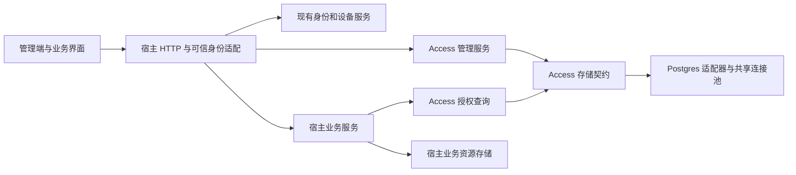

# 租户、角色与资源权限模块技术设计 v1

设计基线：2026-09-18（提交 `87c386d`）；实施状态核对：2026-09-25。

状态：Core Access、PostgreSQL `tenant_v2`、认证/OIDC、租户设备、管理 HTTP、React 管理后台及参考服务两模式装配已接通；租户内业务权限定义可手动创建、查询、更新、启停、归档。宿主嵌入登录、本人角色和权限目录组件已提供。独立真实业务宿主示例、设备自助界面与性能验收仍待完成。本文部分旧实施记录仅供历史对照；当前边界见[当前交付与验收](tenant-access-execution-plan.md)和[README](../README.md)。

**当前权限模型**：业务权限定义由 IdP Core 按租户提供动态管理，以数据库中的 `(tenant_id, resource_type, action)` 目录作为授权判断依据。IdP 保存标识和管理信息，不规定宿主操作的业务含义；相同 key 在不同租户是独立实体。宿主静态 `PermissionCatalog` 只可作为可选初始化模板，不能替代手工管理，也不是业务授权检查的运行时白名单。内置平台/租户管理权限仍受保护，宿主仍负责在业务操作中调用权限检查。

## 1. 目标与已确认约定

建设可由宿主独立装配的 Access 模块，负责租户成员关系、角色、权限定义、资源范围授权及查询。既支持本项目管理端，也支持宿主业务服务调用。

已确认的产品约定：

1. 一个用户可以拥有多个角色，一个角色可以包含多个权限。
2. 用户查看自己在什么范围拥有哪些角色；代码执行层检查具体权限。
3. 支持自定义资源类型、动作和资源实例，例如读取指定报告。
4. 授权描述格式为 `tenant_id/subject_id::resource_type::action[::resource_id]`。
5. 缺省或空的 `resource_id` 表示资源类型级范围，覆盖该域内现有和未来的同类型资源。
6. `0` 是保留的无租户域，不表示所有租户；非 `0` 值是租户 ID。
7. 服务启动时确定是否开启租户能力；只有开启时才提供租户管理和切换界面、接口。
8. 初次启用时显式指定超级管理员；`/admin` 相关接口只供管理端。
9. 必须支持查询用户角色、检查权限、查询角色权限、查询用户所属租户，并考虑大量授权记录下的性能。
10. 同一用户在各租户保留同一 user_id 和登录凭证；创建用户时必须同时绑定一个明确租户，不允许创建无租户用户。
11. 管理端可搜索租户并把已有用户绑定到其他租户；邀请机制留待以后加入。
12. 登录页面支持固定租户与不固定租户两种服务端策略；不固定租户时，用户认证后查看已加入的租户并选择进入。
13. 设备属于具体租户，设备管理、密钥、账号设备绑定和设备证明都限制在该租户内。
14. 系统尚未上线，直接采用新模型，不设计旧接口、旧数据或旧凭证兼容与历史数据迁移。

目标模型是“用户必须归属租户，可被显式绑定到多个租户”。共享 user_id/凭证仅用于识别同一个人，不提供脱离租户的业务账号、角色、会话或权限。身份验证与进入租户分两步；业务会话和 Token 从第一版起绑定具体租户。

## 2. 范围与非目标

### 2.1 首版范围

- 租户启用模式、租户创建/停用/归档、成员加入/停用/移除。
- 自定义角色、权限目录、资源类型级和资源实例级角色分配。
- 单次与批量权限检查、本人查询、受控的管理员查询。
- 平台管理与租户管理的权限边界、启动初始化、授权变更审计。
- 注册时原子建立用户与租户绑定、固定租户登录、认证后选择租户、租户内设备管理。
- Postgres 持久化、连接复用、索引、游标分页和资源列表过滤集成。
- 对既有管理接口补齐操作者与服务层授权，对宿主说明租户接入契约。

### 2.2 首版不包含

- 角色继承、显式 deny、正则/通配符权限、直接给用户授予单条权限。
- 组织树、部门树、用户组、工作区到报告的自动继承、资源所有者自动授权。
- 分享链接、匿名授权、机器主体、租户自助注册、邀请邮件工作流。
- 策略语言、独立授权微服务、分布式决策缓存、跨数据库分布式事务。
- 同一个人在不同租户重复注册不同 user_id/密码；每租户独立的 OIDC issuer 或数据库。
- 历史数据迁移、兼容入口、旧 Token/设备证明格式的双重解析、部署模式在线转换。

工作区成员可以访问报告等规则仍由宿主明确执行，不能仅凭资源 ID 的前缀推导。将来如果这些关系成为主要需求，再设计关系授权扩展。

## 3. 设计基线时的实现审计（历史）

下表记录 2026-09-18 设计时的旧代码状态。有关租户字段、管理认证和参考服务的缺口已在后续阶段处理；当前行为以代码、测试和本文开头的实施状态为准。

| 当前事实 | 代码依据 | 对本设计的影响 |
| --- | --- | --- |
| Account 没有租户绑定约束，邮箱在部署内唯一 | [domain.rs](../crates/embedded-idp-core/src/domain.rs)、[初始表结构](../crates/embedded-idp-storage-postgres/src/sql/0001_initial.sql) | 重写创建契约，创建用户与首个租户关系必须同事务；邮箱仍识别共享凭证的同一用户 |
| AuthSession、AuthorizationCodeRecord、设备和账号设备绑定没有 tenant_id | [domain.rs](../crates/embedded-idp-core/src/domain.rs) | 这些对象新增必需租户字段和复合关联约束 |
| JWT 校验结果含 subject/session/client/scope，没有租户上下文 | [token.rs](../crates/embedded-idp-core/src/token.rs)、[jwt.rs](../crates/embedded-idp-security/src/jwt.rs) | 签发、验证和宿主认证上下文完整传递 tenant_id |
| 管理命令没有操作者参数 | [admin_contracts.rs](../crates/embedded-idp-core/src/service/admin_contracts.rs)、[admin.rs](../crates/embedded-idp-core/src/service/admin.rs) | 不能只新增授权查询接口，还要接入既有受保护操作 |
| AuthenticatedSubject 只有 account_id，管理员入口由宿主保护 | [Axum lib.rs](../crates/embedded-idp-axum/src/lib.rs) | 新增经认证的 tenant_id/session_id，禁止由业务 Header 改写 Token 的租户 |
| 参考宿主曾用开发 Header 和统一 Admin API Key | [bootstrap.rs](../crates/embedded-idp-app/src/bootstrap.rs)、已删除的旧 Web API 客户端 | API Key 不能被直接当作某个人的超级管理员身份 |
| 审计基线每次 transaction 新建连接；P2 已改为共享有界池 | [adapter.rs](../crates/embedded-idp-storage-postgres/src/adapter.rs) | 现已使用 r2d2_postgres；clone 共享连接数上限 |
| 现有分页元数据要求 total，PageRequest 支持 offset | [paging.rs](../crates/embedded-idp-core/src/paging.rs) | 新模块使用独立游标结果，避免热路径 COUNT 和深 OFFSET |
| schema 健康检查只接受当前版本和不变量 | [migration.rs](../crates/embedded-idp-storage-postgres/src/migration.rs)、[adapter.rs](../crates/embedded-idp-storage-postgres/src/adapter.rs) | 直接更新新空库 schema 和检查项，不维护历史版本转换 |

安全不变量沿用 [Production Security Extension v2](./rust-embedded-idp-production-security-extension-design-v2.md) 和 [Delivery v2](./rust-embedded-idp-production-security-delivery-v2.md)：refresh 原子事务、密钥验证、nonce 防重放和宿主可信认证仍必须成立。本文将租户加入 Token、关联约束和设备签名格式；涉及的旧接口和协议字节直接更新，不沿用历史交付文档的数据迁移安排。

## 4. 独立模块架构

### 4.1 独立的含义与代码布局

Access 是独立业务能力模块，有自己的公开契约、构造参数、状态、存储契约、管理路由和测试。首版在现有 crate 边界内组织，不增加独立进程，也不要求为了授权先实例化 AuthService 或 OIDC Service。

以下布局是设计草图；现有 HTTP 路由按 `tenant_*`、`*_admin` 模块组织，并非逐项采用此目录名。

```text
embedded-idp-core/src/access/
  mod.rs          # 公开能力入口
  model.rs        # Tenant / Membership / Role / Permission / RoleBinding
  descriptor.rs   # 授权描述解析和规范化
  contracts.rs    # 查询与管理命令、结果、错误
  service.rs      # 授权与管理规则
  store.rs        # 独立读存储与写事务契约

embedded-idp-storage-postgres/src/access/
  ...             # 上述契约的 SQL 和事务实现
embedded-idp-storage-postgres/src/sql/
  ...             # 新版初始化 DDL 和约束

embedded-idp-axum/src/access/
  ...             # 独立 state、本人查询、管理 DTO 和路由

web/management/
  ...             # 管理后台与角色、成员、租户、权限页面
web/embedded/
  ...             # 宿主可嵌入的业务与管理组件入口
```

领域规则仍属于 `embedded-idp-core`，HTTP 属于 Axum，SQL 属于 Postgres 适配器，装配与环境配置属于宿主，遵守 [AGENTS.md](../AGENTS.md)。这里的“单独模块”不等于新增一套分层体系；若以后需要跨仓库单独发布，再按此边界提取 crate。

独立性要求：

- 新模块不把所有方法追加进旧的聚合 `StoreTransaction`；使用 `AccessReadStore` 和 `AccessTransactionRunner`。
- 用独立 `AccessHttpState` 装配新路由，不让每个仅使用注册/登录的宿主被迫填入一组可空字段。
- 复用并扩展 Account、Clock、ID 生成器和现有 Token 端口；用户凭证归身份模块，成员和角色关系归 Access，设备生命周期归设备服务。
- 身份服务通过明确的组合事务完成“创建用户 + 首个成员关系”和“进入租户 + 创建会话”，不在 HTTP 层拼接两个非原子操作。
- Disabled 也使用同一套 Access 契约，只是绑定固定 `0` 域；不保留可以创建无租户用户的旧服务签名。
- 业务资源不在 Access 存储契约中。独立模块表示职责与装配独立，不表示可以省略身份和设备服务所需的租户约束。
- 管理路由统一使用新服务规则，删除旧式无操作者入口，不增加兼容分支。

### 4.2 调用边界



管理端操作由 Access 管理服务检查；宿主业务服务检查 Access 决策后，再结合资源存在性、归属、业务状态执行操作。UI 隐藏按钮仅改善体验，不作为安全措施。

### 4.3 部署拓扑与数据库边界

本模块支持两种装配方式：

- **独立部署**：一个 IdP 服务同时提供管理端和对外 IdP API，使用一个 IdP 数据库。
- **嵌入部署**：宿主组合所需的 Core、存储与 Axum 路由。IdP 管理端可另起服务、由宿主挂载，或不对外提供；宿主也可通过 IdP 管理接口和前端能力封装自己的控制台。启用的 IdP 入口共同使用同一个 IdP 数据库；宿主业务数据库保持独立，可以与 IdP 数据库位于同一 PostgreSQL 实例，也可以位于另一台服务器。

两种方式都只有一份 IdP 数据，不把管理端和宿主 API 拆成两套身份、租户或授权表。现有的 public/subject/token/client-authenticated/admin 路由分组只是 HTTP 暴露和信任边界，不代表管理端与宿主使用不同数据库。管理路由可不挂载；但宿主控制台若调用 IdP 管理 API，仍必须装配受保护的管理服务/路由并执行相同操作者授权。

当前仓库已有 `PgStorageConfig -> PostgresStorageAdapter::new -> Core service` 的注入路径（见 [reference host bootstrap](../crates/embedded-idp-app/src/bootstrap.rs) 和 [Postgres adapter](../crates/embedded-idp-storage-postgres/src/adapter.rs)）。注入独立数据源是已有能力，不列为新增任务；注入的是配置和适配器，并非宿主现成的连接池。当前 transaction runner 已使用真实有界连接池，每个进程内由同一 adapter 克隆装配的 IdP 组件共享池；不同服务进程各持自己的池，连接同一 IdP 数据库，并由部署方统筹总连接预算。

本节定义部署与数据边界。租户绑定认证、Token、设备和管理流程现已在参考服务中接通；嵌入业务宿主的生产装配与性能仍需独立验收。

## 5. 租户模式与身份模型

### 5.1 启动配置

```rust
pub enum TenancyMode {
    Disabled,
    Enabled,
}

pub struct AccessConfig {
    pub tenancy: TenancyMode,
    pub permission_catalog: Vec<PermissionDefinition>,
}

// 由宿主为登录入口/客户端选择，不能由请求 JSON 自行改写。
pub enum LoginTenantPolicy {
    Fixed { tenant_id: String },
    ChooseAfterAuthentication,
}
```

初始化管理员的输入单独交给 bootstrap 操作，不把永久超级管理员名单写成每次启动都强制覆盖的运行配置。宿主解析环境变量，再传入类型化配置；Core 不读取进程环境。

数据库保存已激活的 tenancy mode 和模块 schema 版本。启动参数必须与持久化状态一致；不一致拒绝 readiness，首版不提供模式转换。首次空库初始化在锁保护下写入模式。

| 行为 | Disabled | Enabled |
| --- | --- | --- |
| 普通业务授权域 | 固定 `0` | 必须为真实租户 |
| 注册的 tenant_id | 服务端固定为 `0`，Core 入参仍明确带值 | 必须来自固定入口或明确选择的真实租户，否则拒绝 |
| 登录策略 | 仅 Fixed(0) | Fixed(真实租户) 或 ChooseAfterAuthentication |
| 业务请求的 tenant_id | Token/会话固定为 `0` | 从 Token/会话确认真实租户，外部选择必须一致 |
| 非 `0` tenant_id | 拒绝，不能静默忽略 | 校验租户、成员、权限 |
| 租户管理/切换 UI 和 API | 不显示、不挂载 | 按权限提供 |
| 本人租户列表 | 不提供租户路由 | 仅返回本人所属的真实租户 |
| 平台管理身份 | 绑定 `0`，仅在管理入口使用平台权限 | 显式绑定保留域 `0`，不会自动拥有真实租户权限 |

Disabled 下业务授权使用 `0`，宿主业务数据可沿用无租户存储，或显式使用 `tenant_id='0'`。Enabled 下 `0` 仅用于显式的平台管理操作，普通业务资源及其授权都必须归属于真实租户，不能写入 `0`。不会从真实租户回退到 `0` 查业务权限。内部用保留域行统一引用，不将该行展示成真实租户。

### 5.2 共享用户标识与凭证，创建必须归属租户

同一个人只有一份 user_id 和登录凭证，但任何可登录的用户必须绑定至少一个租户。存储一份共享身份资料是为了避免复制密码，并不产生无租户账号或无租户业务访问能力。

```text
在 t1 注册：创建 User(u1) + Membership(t1, u1)，同事务提交
管理员绑定：新增 Membership(t2, u1)，复用 u1 和凭证

t1/u1 → t1 的角色、t1 的会话、t1 的设备绑定
t2/u1 → t2 的角色、t2 的会话、t2 的设备绑定
```

- 创建命令必须有 registration_tenant_id，目标租户存在、可注册且 active；无租户创建直接拒绝。
- 注册时原子插入用户、首个成员关系和邮箱验证记录，任何一步失败全部回滚；验证前用户不可登录。
- `registration_tenant_id` 记录来源，不是永久“主租户”；用户后来可离开原注册租户，只要仍有其他租户绑定。
- 用户级凭证停用/安全封禁影响该人的所有登录，仅本人安全流程或平台安全管理可执行。租户管理员的“禁用用户”只停用本租户成员关系。
- 成员停用使该租户的会话不可用并撤销该租户会话族，其他租户会话不受影响；保留角色分配，重新启用后可重新登录获得原有授权。
- 成员移除同时清除该租户角色分配和账号设备绑定、撤销该租户会话。设备本身仍属于该租户，不随用户移走。重新加入不恢复旧绑定或会话。
- 不允许仅移除最后一个租户关系而留下无租户用户；应先绑定新租户，或使用显式注销流程关闭用户、撤销全部凭证。关闭的审计/历史记录不具备登录能力。
- Enabled 下普通注册禁止使用 `0`；`0` 仅用于显式创建/绑定的平台管理身份，且只在专用管理登录入口接受。

部署内登录邮箱继续唯一，因为不固定租户登录需要用一组凭证识别同一个人。某邮箱已存在时，另一租户的公开注册不得自动绑定已有用户，也不得覆盖密码；必须经授权的管理绑定或未来的邀请接受流程。错误响应应避免公开枚举用户在哪些租户。

租户 ID 与 OIDC client_id 无关。首版真实租户 ID 推荐 UUIDv7 文本；Rust/HTTP 使用不透明字符串。

### 5.3 管理端搜索与跨租户绑定

平台管理员可按租户 ID 精确搜索或按名称分页搜索，选择目标租户后将已有用户绑定过去。用户详情展示其已绑定租户、各自状态和角色；租户管理员仅能查看本租户所需资料，不能枚举该用户在其他租户的关系。

绑定操作验证管理权限、目标租户 active、用户有效以及关系是否已存在；重复请求幂等返回已有关系。新关系默认不带业务角色，可在同一受审计事务中显式分配目标租户已有角色。绝不复制源租户的角色、资源授权、设备、会话或密码。

跨租户绑定由平台管理能力执行；普通租户管理员不能仅凭猜到 user_id 就把任意其他租户用户拉入自己的租户。未来邀请采用目标租户邀请 + 用户确认，复用相同成员写入服务，不影响当前 user_id 与凭证。

### 5.4 两种登录策略

策略由服务端按登录入口和已注册客户端配置。页面收到能力信息后展示对应流程；客户端不能把 Fixed 改成 ChooseAfterAuthentication，也不能用请求 tenant_id 覆盖固定值。

| 策略 | 身份验证后的处理 | 成功结果 |
| --- | --- | --- |
| Fixed(t1) | 只检查用户在 t1 的关系、t1 状态及客户端准入，不列出其他租户 | 创建 tenant_id=t1 的会话和 Token |
| ChooseAfterAuthentication | 验证凭证后返回短期选租户票据，显示本人已加入的租户 | 选择有效租户后才创建该租户会话和 Token |

固定策略下，即使用户属于 t2 而不属于 t1，也不能通过 t1 入口登录，更不能自动回退到 t2。可选策略下，列表按页展示所有已加入的业务租户及状态；停用/归档项可以显示原因，但不能进入。`0` 管理域不出现在普通业务选择器。没有任何可进入租户时返回受限状态，不签发业务 Token。

不固定策略不会使注册变成无租户：注册页面仍须先确定目标租户。只有已有用户登录时才允许先验凭证、后选租户。

### 5.5 选租户票据、进入与切换

未选租户时不创建无租户 AuthSession，不签发 access/refresh token。身份模块生成 32 字节安全随机值作为短期 `TenantSelectionTicket`，仅存摘要，默认 5 分钟有效，绑定 user_id、client_id、登录入口策略、认证时间和用途。票据只允许读取本人租户列表和完成一次租户选择，业务、admin、userinfo、refresh 接口均不接受它。

进入流程：

1. 校验票据摘要、期限、用途、客户端绑定、用户状态和当前登录入口策略。
2. 在同一事务重新校验目标租户及成员 active；不能相信之前展示的列表仍然有效。
3. 如客户端要求设备证明，必须使用目标租户的有效设备和同租户绑定；不能带着源租户设备进入目标租户，也不能静默跳过设备要求。
4. 原子消费票据并创建 tenant_id 固定的新会话及 refresh family，签发含 tenant_id 的 Token；事务失败不返回凭证。
5. 一个票据只能成功一次，并发选择两租户最多一次成功；成功后客户端清除票据，按目标租户加载数据。

进入后，每次请求的租户来自经验证的 Token/会话，Header、路径和 body 如提供租户必须与之相同。切换必须获取目标租户的新会话和 Token，不能修改已有会话的 tenant_id。

可选策略允许从有效的源租户会话申请新选择票据；服务先重新验证会话、用户、源成员以及客户端策略，再用上述流程进入目标租户。Fixed 策略不提供该切换能力。源会话是否退出由显式 logout 决定，默认不影响其他标签页；两个标签页可以分别持有 t1 和 t2 的租户会话。高敏宿主可要求切换前重新认证，但不能省略目标成员和设备检查。

UI 切换时取消旧请求/丢弃旧响应，数据缓存键包含 tenant_id 和 user_id。需要多标签页独立选择的 Web 宿主应使用标签页隔离的凭证上下文或宿主已有的安全会话选择机制，不用单一 Cookie 的可变“当前租户”造成互相覆盖；Token 不持久化到可被其他页面随意读取的共享存储。

浏览器使用选择票据时，宿主应采用 HttpOnly 短期 cookie 配合 CSRF 防护，或客户端内存中的显式票据。票据响应禁止缓存，日志与 Debug 脱敏；不能放在 URL/query 中。所列机制复用身份模块现有随机数、摘要和 SecretString 能力，不另造签名系统。

## 6. 权限规范与作用域

### 6.1 授权描述语法

```text
tenant_id/subject_id::resource_type::action[::resource_id]

0/u123::report::read
t001/u123::report::read::r001
t001/u123::report::update::
```

最后一个示例规范化为 `t001/u123::report::update`。

这是一条授权查询/有效授权的描述，不是权限目录的主键，也不是独立凭证。当前业务权限定义按 `(tenant_id, resource_type, action)` 建键。主体和具体资源来自角色分配及请求，不能凭相同 key 跨租户复用定义或授权。

首版解析规则：

- tenant/subject：1–128 个 ASCII 字符，仅 `[A-Za-z0-9_.-]`；当前账号在 Postgres 仍必须是合法账号 UUID。
- resource_type/action：1–64 个 ASCII 字符，格式 `[a-z][a-z0-9_.-]*`，大小写敏感且仅接受小写目录标识。
- resource_id：1–256 个 ASCII 字符，仅 `[A-Za-z0-9_.-]`；有其他业务标识格式的宿主先映射为稳定不透明 ID。
- 仅末尾 resource_id 可以为空；不 trim，不 URL decode，不忽略额外段，不接受 `*`。
- 整串上限 1024 字节；拒绝控制字符、空主体、空租户、额外 `/` 和 `::`。
- JSON 接口中 null/缺省资源 ID 均归一化为 `None`，空字符串可在适配层归一化；存储中禁止空字符串。
- 角色分配写接口要求显式 `scope.kind = type | instance`，不能因遗漏字段意外授予全部资源。

字符串是展示/导入格式；主接口使用结构化字段。查询实际业务操作时，subject 来自认证结果，action 来自服务端操作定义，resource 来自实际目标。

### 6.2 角色与范围的组合

`RolePermission` 只存资源类型和动作；`RoleBinding` 存租户、用户、角色、资源类型和可选资源 ID。

```text
角色 reader：report/read
角色 editor：report/read、report/update

分配 A：t1 / u1 / reader / report / r1
分配 B：t1 / u1 / editor / report / None
```

多个角色授权取并集。B 覆盖 t1 的全部报告，包括后来创建的报告。A 对 r1 提供额外来源；删除 A 不影响 B。

角色可以包含多个资源类型；一次 RoleBinding 只覆盖明确的一个类型。例如角色包含 report/read 和 dataset/read，只分配 report 范围不会同时获得 dataset 权限。UI 的“一次分配多个类型”落为一个事务中的多条 binding，不引入隐式全部类型通配符。

后续给角色新增同类型动作，会立即扩展该角色已有有效分配；新增其他资源类型，不会自动生成相应 binding。修改角色前应展示受影响用户/绑定数量，修改需版本检查及审计。

### 6.3 匹配规则

对查询 `Q = (tenant, subject, type, action, optional id)`：

1. 部署模式允许该域与权限目录类别；业务权限必须存在于查询指定的同一租户中。
2. 用户身份 active、域 active、该域成员 active；实际执行接口还须通过同域会话认证。
3. 存在同域同用户的 binding，关联同域 active role。
4. binding.resource_type 与查询 type 完全相同。
5. 角色包含目录中仍启用的 `(type, action)`。
6. 查询指定 ID 时，binding ID 为 None 或等于查询 ID；查询类型级时，只有 None 可以匹配。

任一符合全部条件的授权即可 Allow；否则 Deny。数据库不可用或内部错误返回错误，不能伪装成 Allow，也不应统一伪装成普通无权限。

| 已有授权 | 查询 | 结果 |
| --- | --- | --- |
| `t1/u1::report::read` | `t1/u1::report::read::r1` | Allow |
| `t1/u1::report::read::r1` | `t1/u1::report::read` | Deny |
| `t1/u1::report::read::r1` | `t1/u1::report::read::r2` | Deny |
| `t1/u1::report::read` | `t2/u1::report::read::r1` | Deny |
| `0/u1::report::read` | `t1/u1::report::read::r1` | Deny |
| 任意授权，但成员 suspended | 同租户查询 | Deny |

类型级查询不是“至少能访问一条资源吗”。界面需要判断功能入口时，可单独使用 `has_any_resource_access` 查询；它不能用来放行任意指定资源。首版 UI 优先结合有效授权列表判断入口，不新增含混的自动推断。

### 6.4 资源存在性和生命周期

Access 不维护报告表，不证明目标资源存在。Allow 的精确定义是“授权记录允许该动作”；执行前宿主仍须按 `(tenant_id, resource_id)` 加载资源。

宿主资源 ID 应不可复用。删除资源时清理对应实例 binding；同库可与业务删除共用事务，跨库由宿主可靠重试清理。即使清理延迟，已删除资源仍不能执行操作。若复用 ID，遗留授权会落到新对象，因此禁止复用是必要契约。

新建资源通常检查类型级 create 权限，不能让客户端用尚不存在的任意 ID 绕过类型级要求。读/改/删单个资源的接口则必须传入实际 ID。

## 7. 权限目录与管理权边界

### 7.1 租户内权限定义

IdP Core 定义**租户内**业务权限目录的创建、读取/列表、元数据更新和删除/归档契约；PostgreSQL 适配器实现事务与审计，Axum 提供可选管理路由，独立 App 提供管理页面。嵌入宿主可以复用相同管理接口建设自己的控制台，不能绕过 Core 权限规则。Enabled 下租户管理员可以手动维护本租户的业务权限及其角色/分配；平台管理员跨租户操作须显式选定目标域并通过管理授权。Disabled 下由 `0` 域管理员维护。内置 `platform`/`tenant` 定义仍由 IdP 控制，不可通过业务 CRUD 创建、修改或删除。

业务权限定义的唯一键是 `(tenant_id, resource_type, action)`。同一个 `resource_type::action` 在两个租户中可以有不同的展示名称、说明、启停状态与角色关联，互不继承、互不回退；Enabled 的平台 `0` 不作为真实租户业务目录。IdP 不解释某个标识代表读取报告还是其他操作，创建权限也不会自动保护宿主接口。宿主/业务调用方自行约定该标识的含义，并以可信的租户、用户和实际资源调用授权检查。

落地时使用同一张 `access_permissions` 表，以 `(tenant_id, resource_type, action)` 为主键；角色权限通过同域复合外键引用。内置 `idp.platform` 仅位于 `0`，内置 `idp.tenant` 随真实租户创建受保护的同域记录；Disabled 模式的管理定义位于 `0`。业务权限在 Enabled 的真实租户中手动创建，Disabled 固定在 `0`。不再从平台目录或其他租户回退读取业务定义。为避免旧结构被误当成新版，改变表结构时提升 schema 版本；旧开发 schema 不原地改写，需显式准备新空 schema。

写接口需要带可信管理上下文和明确目标域：创建业务权限、读取单条/游标列表、更新展示信息及启停状态、归档删除。权限键和租户归属不可编辑；每次修改带读取时版本，写入在同域事务内重验管理员身份与权限并审计。租户安全管理员持受保护的 `permissions.manage` 能力管理本域业务定义；平台管理员经 `access.manage` 可显式选择目标域，不能把平台会话当作业务租户会话。归档是不可恢复的逻辑删除：保留标识与审计，立即拒绝授权，不能被普通创建重用；停用可恢复，界面必须说明恢复可能让旧角色授权重新生效。

独立 App 的管理页面与宿主控制台都调用同一套管理契约。IdP 可提供前端组件供宿主组合，接口不依赖页面是否挂载。宿主仍必须在对应业务操作中调用授权服务；IdP 无法仅凭目录标签发现宿主的实际业务逻辑。

同一租户内的权限键 `resource_type::action` 创建后不允许改写；说明可以更新。归档保留定义和角色关联，但立即禁止授权、不可恢复且键不能重用；这样不会静默恢复旧授权。查询租户的目录中不存在、停用或归档的权限一律 Deny，不能读取其他租户的同名定义。授权热路径以持久化目录为准，不再要求业务权限同时出现在进程内 `PermissionCatalog`；启动就绪只强制内置管理权限和结构不变量。

`PermissionDefinition` 包含 tenant_id、resource_type、action、description、category、enabled、archived 和 version。业务定义只允许使用非 `idp.` 资源类型；同一租户内同一 resource_type 的所有动作保持相同 category。内置管理权限只能由模块初始化，业务 CRUD 不能修改。

创建定义不会自动加入角色；角色授权仍需同租户显式关联。停用保留关联，重新启用可能恢复已有授权；归档保留关联和审计但不允许恢复。请求缺失、停用或归档的业务键都默认拒绝。管理页面不再调用旧的部署级同步接口；Core 内保留 `SyncPermissions` 供显式宿主模板初始化，但按目标租户执行且只插入缺失定义，不覆盖该租户已有的业务说明或状态。

### 7.2 管理角色

建议内置受保护角色：

| 角色 | 域与能力 | 限制 |
| --- | --- | --- |
| system_admin | `0` 域，`idp.platform` 下的 users.read / users.security / tenants.manage / users.bind / clients.manage / access.manage / audit.read | 跨租户管理走显式受审计方法，不对业务查询做万能 bypass |
| tenant_security_admin | 指定域，`idp.tenant` 下 members.manage / roles.manage / grants.manage / access.read / devices.manage / sessions.manage / audit.read | 可管理本租户成员、设备和会话；不能重置共享凭证、管理其他租户或平台角色 |
| 普通业务角色 | 同域内的业务权限 | 不能包含 platform 或 tenant 安全管理权限 |

受保护管理角色只能通过专门的管理员任命/撤任操作分配，不能由普通角色 CRUD 复制或修改。平台管理员可以任命真实租户的安全管理员；这条跨域操作由平台管理服务显式执行和审计，不表示平台授权自动匹配真实租户。

租户安全管理员是该租户的受信任授权管理员，可以给自己或他人分配业务权限，但不能把未知外部用户直接加入租户。平台管理员可查询用户与租户并执行跨租户绑定；虽然没有直接读取业务资源的 bypass，但能经受审计的操作改变授权，本设计不声称对其实现强隔离或双人审批。

### 7.3 管理员初始化

1. 宿主显式提供初始管理员身份信息，使用受限的离线 bootstrap 创建用户时同时绑定保留域 `0`，不能先创建一个无租户用户；安全密码/外部凭证由宿主安全提供。
2. 首次初始化锁定模块状态，原子建立管理员用户、`0` 域关系、system_admin 角色、其 `idp.platform` 类型级 binding 和审计事件。该身份只能通过专用管理入口进入 `0`；普通业务登录不能选择 `0`。
3. 同事务写入 bootstrap marker，禁止多个实例竞争产生隐式管理员。
4. 后续启动只验证已有状态，不重新授予已撤销的 bootstrap 账号；管理员变更走管理流程。
5. 初次未指定管理员或目标不可用时，管理能力不进入 ready。已有部署管理员状态损坏则拒绝管理 readiness，保留受控的运维修复路径。

不会自动把第一个注册用户、某个邮箱域或持有开发 API Key 的请求提升为超级管理员。不得在文档、示例和日志中包含真实 bootstrap 密码。

最后一个有效平台超级管理员不能被撤任、移除成员或停用身份。active 的真实租户也应保留至少一名有效 tenant_security_admin；创建租户时原子建立/绑定首位管理员。归档租户可以解除该租户的最后管理员要求，但不能借此绕过平台管理员或“用户至少归属一个域”的约束。

### 7.4 租户创建与状态管理

`CreateTenant` / `UpdateTenant` 仅在 Enabled 模式提供，目标不能为 `0`，操作者必须是平台身份并具有 `idp.platform/tenants.manage`。创建还检查 `users.bind` 与 `access.manage`，接收明确的租户 ID、名称、注册准入及首位管理员来源。来源必须二选一：`existing` 指定已有 active 用户 ID，保留原 user_id/凭证；`new` 提供管理员邮箱和初始密码，系统生成 user_id 并创建 active 账号，新建路径额外要求 `users.security`，复用宿主注入的密码规则与 Argon2 哈希。邮箱冲突拒绝整个创建，不覆盖密码、不自动改为绑定。账号（若新建）、租户、首条成员关系、受保护租户角色、类型级管理员分配及审计在同一事务建立；不会先创建无租户用户。新建账号同时记录 `account.create` 和 `tenant.create`，任一审计失败全部回滚，审计与响应不包含密码或哈希。创建独占 state 锁，避免尚不存在的域行造成并发初始化竞态。

更新要求 `expected_version`，可修改名称、注册准入以及 active/suspended/archived 状态，不开放物理删除。停用/归档撤销本租户全部会话和 refresh family，清理授权码、邮箱验证码、设备 nonce，并撤销来源为本租户的选择票据及当前成员的无来源选择票据；其他租户来源的票据保持不变。成员、角色授权、设备归属与账号设备绑定保留，授权查询因租户状态立即拒绝新查询；后续身份/设备入口也须校验租户状态。

恢复 active 必须仍有有效租户管理员，检查失败会回滚状态和版本。若停用期间已清理最后管理员，普通恢复命令不会自动补管理员。恢复不复活旧凭证，用户须重新认证；恢复后保留的成员与角色可重新生效。审计写失败会回滚租户状态及全部凭证清理。

## 8. 数据模型、约束与索引

### 8.1 表设计

直接修改现有身份表，并新增 Access 表；不保留历史数据转换逻辑。Account 继续存一份共享 user_id 与凭证，成员关系表达这个人在哪些租户可使用该身份。新增 Access 表在当前配置的 Postgres schema 内以 `access_` 前缀隔离。

| 表 | 主要字段与约束 |
| --- | --- |
| access_state | 单行 PK；tenancy_mode、module_version、bootstrap_completed_at；用于启动一致性和关键管理锁 |
| accounts（修改） | id uuid PK、registration_tenant_id NOT NULL、email UNIQUE、password_hash、status(pending_verification/active/disabled/closed)、display_name、created_at；来源租户 FK，注册必须同时插入首个 membership |
| access_tenants | id text PK、kind(system/tenant)、name、status(active/suspended/archived)、allow_registration、version、created_at；`id='0'` 当且仅当 kind=system |
| access_memberships | tenant_id、account_id uuid、status(active/suspended/removed)、version、joined_at、removed_at；PK(tenant_id, account_id)，FK 域和用户记录；removed 仅保留历史引用，不算已加入 |
| access_permissions | tenant_id、resource_type、action、category、description、enabled、archived、version；PK(tenant_id, resource_type, action)；保留 IdP 内置管理权限的保护边界 |
| access_roles | tenant_id、id uuid、key、name、status(active/disabled)、system_kind nullable、version、created_at；PK(tenant_id,id)，UNIQUE(tenant_id,key) |
| access_role_permissions | tenant_id、role_id、resource_type、action；复合 PK 全字段，复合 FK 到同域 role 和 permission，不能引用其他租户的同名定义 |
| access_role_bindings | id uuid PK、tenant_id、account_id、role_id、resource_type、resource_id nullable、created_at、created_by；复合 FK 到 membership 和同域 role |
| access_audit_events | id uuid、occurred_at、actor_id、actor_domain、target_domain、operation、target identifiers、before/after、request_id；追加写入 |

身份和设备表调整：

| 表 | 必需变化与约束 |
| --- | --- |
| email_verification_codes | tenant_id NOT NULL；验证绑定注册租户 + 用户 + 验证码，不能拿另一租户的验证码加入当前租户 |
| auth_tenant_selections（新增） | id、ticket_digest UNIQUE、account_id、client_id、login_entry、purpose、authenticated_at、expires_at、consumed_at、revoked_at、可选 source_tenant_id/source_session_id；只供选租户，不是业务会话 |
| auth_sessions | purpose 为 business/management；tenant_id NOT NULL；FK(tenant_id,account_id) 到成员关系；UNIQUE(tenant_id,id)；可选 device_id 必须通过同租户复合 FK；scope 记录委托范围，authenticated_at 记录原始认证时间 |
| authorization_codes | tenant_id NOT NULL；仅存 32 字节 code_digest；同租户成员关系及 source_session_id 复合 FK；保存 client_id/login_entry、redirect_uri、scope、nonce、PKCE、有效期和消费时间；换码不能替换 tenant_id |
| refresh_tokens | tenant_id NOT NULL；FK(tenant_id,session_id)；按摘要查找后仍校验租户一致，family 不能跨域 |
| devices | tenant_id NOT NULL；UNIQUE(tenant_id,id)，设备创建后不允许修改归属 |
| account_device_bindings | tenant_id NOT NULL；分别复合 FK 到成员和设备；唯一关联含 tenant_id |
| device_proof_keys | tenant_id NOT NULL；复合 FK 到设备；key_id 仍唯一防止跨租户复用同一公钥，version 唯一和 active-key 部分索引改为租户+设备 |
| device_nonces | tenant_id NOT NULL；复合 FK 到设备；tenant、device、purpose、digest 全部参与校验 |

所有用户引用使用同一个 account_id，不能为 t2 复制一份新的用户凭证。所有会话、码、设备关联必须通过 tenant_id 确认所属域，禁止单凭共享 account_id 放行。

至少一个租户关系是提交时不变量：非 closed 用户必须有至少一条非 removed 的 membership。注册使用组合事务；成员移除时按第 12.4 节锁定用户后检查剩余关系，防止两个租户并发移除各自最后一条。Postgres 增加延迟到事务提交的约束触发器，针对用户创建/恢复与成员移除/删除检查非空关系，避免保存仅有 accounts 行的用户。触发器锁定相应用户并按 account_id 的反向索引检查，不扫描所有用户；关联的 tenant_id/account_id 不提供原地改写操作。

成员移除采用 status=removed，保留复合外键供历史会话和设备绑定引用。同事务删除角色分配、撤销该域全部 session/refresh family、消费未使用授权码/验证记录、将账号设备绑定改为 unbound。重新加入同一租户可重新激活关系行，但已撤销的会话、旧验证码、旧设备绑定和角色不会恢复。注销把用户标记 closed、撤销所有会话/选择票据并清除授权与有效设备绑定；保留不可登录的历史记录，不存在可继续使用的无租户身份。

领域内 role/membership/tenant 的时间来自注入的 Clock；版本为单调递增整数，仅用于并发编辑，不被当成权限缓存有效性凭证。ID 在 Rust/HTTP 保持字符串，role/binding/audit 数据库 ID 使用 UUIDv7，与当前 ID 约定一致。

`0` 行必须始终存在且 active，不能通过租户 CRUD 删除、归档或修改为真实租户。名称等展示字段也不参与权限匹配。

`resource_id IS NULL` 表示类型级授权，`resource_id=''` 禁止。binding 的 resource_type 必须在该 role 中至少存在一个权限；创建/修改时在同事务校验。删除某角色最后一个该类型权限时，同事务清理该类型 binding，避免以后重新加权限使遗留绑定意外复活。若只是禁用角色/目录权限，则保留绑定，重新启用将恢复，界面需要明确提示。

数据库约束阻止跨租户关联：

```sql
FOREIGN KEY (tenant_id, account_id)
  REFERENCES access_memberships (tenant_id, account_id)

FOREIGN KEY (tenant_id, role_id)
  REFERENCES access_roles (tenant_id, id)
```

删除 role 由管理事务先删除关联 binding/role_permissions 并写审计，再删除目标；成员按上述规则逻辑移除。采用 RESTRICT 避免未经服务规则的级联修改；租户首版仅停用或归档，不开放立即物理删除。

### 8.2 Binding 唯一约束和热路径索引

普通 UNIQUE 对 nullable scope 不能表达“类型级只允许一条”。分别使用部分唯一索引：

```sql
CREATE UNIQUE INDEX access_binding_type_unique
ON access_role_bindings
  (tenant_id, account_id, role_id, resource_type)
WHERE resource_id IS NULL;

CREATE UNIQUE INDEX access_binding_instance_unique
ON access_role_bindings
  (tenant_id, account_id, role_id, resource_type, resource_id)
WHERE resource_id IS NOT NULL;

CREATE INDEX access_binding_check
ON access_role_bindings
  (tenant_id, account_id, resource_type, resource_id, role_id);

CREATE INDEX access_binding_subject_page
ON access_role_bindings (tenant_id, account_id, id);

CREATE INDEX access_binding_by_role
ON access_role_bindings (tenant_id, role_id, account_id, id);

CREATE INDEX access_memberships_by_account
ON access_memberships (account_id, tenant_id) INCLUDE (status);
```

补充目录/管理查询索引：memberships 按租户的 PK 可用于成员列表；roles 的 PK 与 key 唯一索引用于域内角色列表；role_permissions 的复合 PK 用于查角色权限；audit 分别建立 `(target_domain, occurred_at, id)` 和必要的平台审计时间索引。

身份/设备热路径增加 `(tenant_id,account_id,status)` 的会话索引、`(tenant_id,client_id,id)` 的设备列表索引、`(tenant_id,account_id,device_id)` 的绑定索引、验证码的 `(tenant_id,email,code)` 查找索引。选租户票据按 digest 唯一查找、按 expires_at 分批清理、按 account_id 撤销；主体查询租户继续使用 memberships 的 account_id 前导索引。

按资源清理绑定需要 `(tenant_id, resource_type, resource_id, id)` 索引。是否需要 permission 反向索引，应按“哪些角色含此权限”的实际查询和 EXPLAIN 增加，避免无依据地给所有字段建索引。

部分索引的谓词必须与实际查询条件兼容，不能假设任何参数化 OR 都会使用它。[PostgreSQL Partial Indexes](https://www.postgresql.org/docs/current/indexes-partial.html)

### 8.3 隔离策略

所有租户存储方法显式接收 tenant_id，禁止 `Option<TenantId>` 的 None 表示查询全部租户。跨域本人租户查询、平台租户管理分别使用明确命名的方法。

首版以明确的 SQL tenant 条件、复合外键、服务规则和隔离测试为基础。RLS 可作为部署加强措施，但不代替应用授权；数据库所有者和 BYPASSRLS 等情形需要单独处理，连接池中的租户设置也必须限于事务并可靠复位。[PostgreSQL Row Security](https://www.postgresql.org/docs/current/ddl-rowsecurity.html)

## 9. 服务契约与查询能力

### 9.1 类型与入口

```rust
pub struct AccessQuery {
    pub tenant_id: String,
    pub subject_id: AccountId,
    pub resource_type: String,
    pub action: String,
    pub resource_id: Option<String>,
}

pub enum AccessDecision { Allow, Deny }

pub trait AuthorizationService: Send + Sync {
    fn check(&self, query: AccessQuery) -> Result<AccessDecision, AccessError>;
    fn check_many(&self, query: BatchAccessQuery)
        -> Result<Vec<AccessDecision>, AccessError>;
}
```

上述是可信宿主使用的库级契约，调用者负责提供已认证主体和实际目标。HTTP 本人接口不接收任意 subject；管理员“替他人检查”由带操作者的管理入口保护。Rust 类型本身不能防御恶意宿主代码，宿主属于本设计的信任边界。

把查询和管理分别暴露为 `AuthorizationService`、`AccessQueryService`、`AccessAdminService`，它们可由同一 `CoreAccessService` 实现，不为每个方法创建一层 wrapper。

当前实现的查询由 `CoreAccessService` 提供；管理写入由 `CoreAccessAdminService` 装配事务存储、`Clock` 与 `IdGenerator`。`execute(context, command)` 显式区分可信管理上下文与操作目标，使用类型化命令和变更前后记录。参考宿主现已装配独立管理认证及 Access 管理路由。

### 9.2 必须提供的读能力

| 场景 | 方法/结果 | 查询约束 |
| --- | --- | --- |
| 用户有哪些角色 | list_subject_roles：去重角色摘要，带 role 状态 | tenant+subject 必填，role_id 游标；不在每个角色内塞无限范围列表 |
| 用户角色的具体范围 | list_subject_bindings：role/type/optional id | 可按 role/type/resource 过滤，binding_id 游标 |
| 用户是否有某权限 | check：Allow/Deny | 包含活跃状态与授权匹配，单次数据库读往返 |
| 一组动作是否允许 | check_many：与输入位置对应的决策 | 同 tenant+subject，1–100 项，一次批量查询，无 N+1 |
| 角色有哪些权限 | list_role_permissions | 同域校验，按 type/action 复合游标 |
| 用户属于哪些租户 | list_subject_tenants：tenant+membership 状态 | account_id 索引；本人选择页展示非 removed 的业务租户及可进入状态，平台管理可查完整历史 |
| 用户有哪些有效授权 | list_effective_grants | 返回 type/action/scope，不展开类型级授权为所有实例 |
| 哪些用户拥有某角色 | list_role_subjects | 同域 role 索引，去重 account_id，权限受控 |
| 允许访问哪些实例 | list_allowed_resource_ids 或同库过滤集成 | 必须区分 All 与有限实例分页；详见第 11 节 |

“配置角色列表”与“有效权限”不同：停用角色仍可在管理视图看到，但不能放行。本人查询返回必要的角色与范围，不暴露其他用户或跨域授权记录。

### 9.3 分页和一致性

新模块结果使用 `items + next_cursor + has_more`，默认 50，最大 200，数据库取 limit+1。与旧 `PageMetadata.total` 分开，不修改已有 API 的分页格式。

游标采用固定排序字段，例如 role_id、binding_id、tenant_id，或 `(resource_type, action)`。游标包含版本及查询过滤摘要，解析时验证长度和过滤一致性。游标从来不是授权凭证，篡改它也不能改变查询 tenant/subject 条件。

新接口不默认计算 total。管理端确需准确数量时使用单独 count 操作，清楚标注它与随后页面数据可能不是同一时刻的快照。

跨页读取是实时视图，期间授权修改可能导致集合变化；它不构成可离线使用的权限快照。后台导出需要单独的快照/流式方案，不用无限放大 page limit。

## 10. 性能、SQL 与一致性

### 10.1 单次权限检查

不加载用户所有角色后逐条加载角色权限。单个 SELECT 使用 EXISTS，同时验证账号、域、成员、角色、权限目录状态。以下为结构示意，实际 schema 名由已验证的适配器配置生成，所有业务值都用参数：

```sql
SELECT EXISTS (
  SELECT 1
  FROM accounts a
  JOIN access_memberships m ON m.account_id = a.id
  JOIN access_tenants t ON t.id = m.tenant_id
  JOIN access_role_bindings b
    ON b.tenant_id = m.tenant_id AND b.account_id = m.account_id
  JOIN access_roles r
    ON r.tenant_id = b.tenant_id AND r.id = b.role_id
  JOIN access_role_permissions rp
    ON rp.tenant_id = r.tenant_id AND rp.role_id = r.id
   AND rp.resource_type = b.resource_type
  JOIN access_permissions p
    ON p.tenant_id = rp.tenant_id
   AND p.resource_type = rp.resource_type AND p.action = rp.action
  WHERE m.tenant_id = $1 AND a.id = $2
    AND b.resource_type = $3 AND rp.action = $4
    AND (b.resource_id IS NULL OR b.resource_id = $5::text)
    AND a.status = 'active' AND m.status = 'active'
    AND t.status = 'active' AND r.status = 'active' AND p.enabled AND NOT p.archived
);
```

上面的权限目录 JOIN 展示当前租户内业务权限查询。`$5 = NULL` 时只匹配类型级 binding；具体 ID 时同时接受类型级和该 ID。Core 在查询前验证输入与部署模式，存储在同域目录中判断权限是否存在且有效；由内存实现和 Postgres 共用验收向量验证。

若 OR 的执行计划在大用户授权集下不稳定，改成同一 SELECT 内的两个 EXISTS 分支，分别走类型级和实例级索引；以 EXPLAIN 和压测决定，不预先构建多套算法。

批量检查把固定 tenant/subject 的有限请求放入 VALUES/UNNEST 表，带序号返回，用同一 statement snapshot 求值。一次错误使整个批次失败，不能用部分 Allow 掩盖存储失败。

### 10.2 数据库连接与异步边界

当前 adapter 已实现共享有界池，`pool.max_connections` 限制在线连接数，所有高频事务和 Access 读取复用连接。`connect()` 返回池连接，构造 adapter 不发起网络连接。

实现沿用同步 `postgres` 技术路径，使用 `r2d2_postgres`（其公开 API 重导出 r2d2），保留 `postgres_native_tls` 的 TLS 配置，不手写连接池，也不为此把整个项目改成异步存储。[r2d2_postgres 文档](https://docs.rs/r2d2_postgres/latest/r2d2_postgres/)

- `PostgresStorageAdapter` clone 共享池，不每次 clone 建池。
- 使用现有 max_connections；当前 connect_timeout_secs 同时限制建连和 checkout 等待。独立 checkout timeout、SQL statement timeout 及宿主有界准入仍是后续项。禁用每次 checkout 的额外 ping，授权执行本身失败即返回错误。
- Axum 沿用 `run_service_call` 的 `spawn_blocking`，但增加与池容量匹配的有界准入，避免无上限排队。
- 池取连接超时或数据库错误返回不可用，绝不降级为允许；数据库日志不包含原始凭证。
- 身份与授权模块共用宿主配置的连接预算，不各自默认开一整池。
- 旧初始化/cutover 脚本持有 session advisory lock，使用专用连接确保所有退出路径释放；新 Access DDL 与在线 runner 使用池及 Rust 事务。旧、新初始化互相拒绝混用。

连接池支持有界等待和共享克隆，适合当前调用模型。[r2d2 Pool](https://docs.rs/r2d2/latest/r2d2/struct.Pool.html)

### 10.3 缓存与撤销承诺

首版不使用跨请求的 Allow/Deny 缓存，也不从异步只读副本进行授权检查。目录的不可变解析元数据可在构造时保存，但 enabled 状态和角色关系仍以主库为准。

撤销的精确承诺是：撤销事务提交后，新开始的授权 SELECT 能看到已提交状态；已经完成的决策、已经开始的 statement、长期事务或运行中的任务不被追溯撤回。不能将此描述为“撤销瞬间终止所有正在执行的操作”。Postgres Read Committed 的 statement snapshot 是这一边界的依据。[Transaction Isolation](https://www.postgresql.org/docs/current/transaction-iso.html)

管理写在同一事务内重查操作者权限并完成修改。宿主高风险业务写如果要求撤权与业务提交有明确先后关系，应使用同连接事务适配：先按第 12.4 节顺序共享锁定 access_state 和目标域行，再重新检查授权、锁定业务行并写入，持锁到提交。授权修改需要域行独占锁，用户级安全封禁和目录变更需要 state 独占锁，因此两者不能在检查和业务提交之间穿插。单纯“放进同一个 Read Committed 事务”但不获取这些协调锁，仍有检查后撤权的竞态。

该事务集成只适用于同库且所有相关写入遵循协议的宿主。跨库先 check 再写不能提供上述保证；文件发送等事务外副作用也不能因数据库锁自动变成原子操作。长时间任务不持有这类锁，应采用明确的再校验检查点。

后台任务持久化 actor、tenant、resource、action，在执行时重新检查。长时间导出/流式任务的中途撤销由宿主明确检查点策略决定。

只有压测证明数据库查询成为瓶颈后再考虑跨请求缓存；届时必须先定义撤销最大延迟和多实例失效协议。TTL 本身不满足立即撤销，版本字段本身也不会自动让缓存一致。

### 10.4 性能验收目标

以下是待实现后验证的目标，不是当前性能数据：

| 项目 | 目标 |
| --- | --- |
| 单次 check | 1 条授权 SELECT，无角色逐条查库，无全量授权 materialize |
| check_many，100 项以内 | 1 次 SQL 请求，按输入顺序返回 |
| 普通列表 | 1 次主查询，limit+1，默认不 COUNT |
| 授权变更 | 事务提交后的新查询可观察到变化 |
| 负载目标 | 参考环境单应用实例 1000 check/s，p95 ≤ 10 ms、p99 ≤ 50 ms，包含池等待、不含外部 HTTP 网络与身份验签 |

参考压测环境固定记录应用/数据库各 8 vCPU、数据库 16 GiB 内存、同区往返 ≤ 1 ms、池上限初始 20；这些是测试条件，不是生产配置保证。数据集至少包含 10 万账号、1000 租户、100 万 binding，同时加入一个用户拥有 1 万实例授权的偏斜场景。

分别测试允许/拒绝、类型级/实例级、热/冷缓存、目录与角色修改、成员停用、连接池耗尽；记录 EXPLAIN (ANALYZE, BUFFERS)、吞吐、p95/p99、pool wait、SQL 时间、CPU 和连接数。SQL 计划必须避免扫描整个系统的授权表，具体复杂度仍受该用户的候选授权量影响，不能承诺恒定时间。

## 11. “列出我能读取的报告”的集成

权限检查与列表过滤使用相同匹配语义，不能先对全部资源分页，再删除无权条目，这会导致漏页和错误数量。

### 11.1 同库宿主

推荐宿主业务查询先限定 `reports.tenant_id = 当前域`，再用相关 EXISTS 检查与该报告 ID 匹配的有效授权，最后排序、分页。业务 SQL 由宿主拥有，Access 提供固定契约和验证示例；不接受客户端提交表名或任意 SQL，不在 Core 硬编码 report 表。

详情查询同样同时限定租户与资源 ID。总数、搜索、导出也使用同一过滤规则，不能只保护详情接口。

### 11.2 跨库宿主

`list_allowed_resource_ids` 返回三种状态：

- `All`：当前域、当前类型、当前动作具有类型级权限。
- `Some { ids, next_cursor, has_more }`：有限的实例 ID 页。
- `None`：当前没有可用授权。

All 仍只覆盖指定租户，不代表跨租户全部资源。有限 ID 页不是报告列表页，授权 ID 也不证明报告存在。宿主要做全量业务排序/搜索时，单靠一页 ID 或固定 100 项批量 check 无法正确完成分页；必须扫描并补齐候选集，或另行设计可接受一致性的授权投影。首版不承诺跨数据库的大规模任意排序与即时撤销同时高效实现。

通过列表结果做出的显示决策不替代后续业务动作的重新授权。

## 12. HTTP、管理操作与事务

### 12.1 路由分组

沿用现有 `/auth`、`/admin` 根，不增加模块全局 `/api` 前缀。宿主可额外挂载前缀。以下是建议的 API 清单：

| 接口 | 用途与约束 |
| --- | --- |
| GET /auth/access/capabilities | 当前登录入口的 tenancy_enabled、login_tenant_policy、固定租户信息和分页上限；不返回其他租户或账号资料 |
| POST /auth/register | 明确目标租户，原子创建用户和首个关系；不能省略租户创建裸用户 |
| POST /auth/login | Fixed 返回租户会话；Choose 返回 tenant_selection_required 和短期票据 |
| GET /auth/tenant-selection/tenants | 仅凭合法选择票据，分页列出本人已加入业务租户与状态 |
| POST /auth/tenant-selection/complete | 消费票据、校验目标租户及设备，签发同租户会话和 Token |
| GET /auth/me/roles | 本人在请求域内的角色摘要 |
| GET /auth/me/role-bindings | 本人在请求域内的具体角色范围 |
| GET /auth/me/permissions | 本人的有效授权，保留类型级范围表达 |
| POST /auth/me/access/check | 本人单次检查，body 无任意 subject_id |
| POST /auth/me/access/check-batch | 本人有限批量检查 |
| GET /auth/me/tenants | 有租户会话的本人查看已加入租户及状态；仅 Enabled + 可选登录策略 |
| POST /auth/me/tenant-selection | 可选策略下，从有效源会话申请短期选择票据；随后必须 complete，不能改旧 Token |
| GET /admin/auth/capabilities | 独立管理登录能力与固定/选择策略，无凭证 |
| POST /admin/auth/login | 只接收 email/password；签发管理会话或管理选择票据 |
| GET /admin/auth/session | 管理 Bearer 校验后的 tenant/account/session |
| POST /admin/auth/refresh | 管理 refresh 轮换；重用检测提交撤销后返回 401 |
| POST /admin/auth/logout | 管理 Bearer，撤销当前会话及 refresh 家族，返回 204 |
| GET /admin/auth/tenant-selection/tenants | 管理选择票据，limit/cursor 分页；仅 Enabled + Choose |
| POST /admin/auth/tenant-selection/complete | 管理选择票据 + tenant_id；仅 Enabled + Choose |
| POST /admin/auth/me/tenant-selection | 管理 Bearer 换取绑定源会话的选择票据；仅 Enabled + Choose |
| GET/POST /admin/tenants | 平台按 tenant_id/name 分页搜索或创建真实租户，仅 Enabled |
| GET /admin/tenants/{tenant_id} | 平台查看真实租户元数据和版本，仅 Enabled；保留域 0 不可读取 |
| PATCH /admin/tenants/{tenant_id} | 更新名称/状态，版本检查；仅 Enabled |
| GET/POST /admin/tenants/{tenant_id}/members | 查询成员；添加已有用户须平台跨租户绑定权限，仅 Enabled |
| PATCH/DELETE /admin/tenants/{tenant_id}/members/{subject_id} | 停用/移除成员，仅 Enabled |
| GET /admin/users/{subject_id}/tenants | 平台管理查看该用户所有绑定及状态，租户管理员不能调用 |
| GET/POST /admin/access/roles | 当前管理域的角色列表/创建 |
| GET/PATCH/DELETE /admin/access/roles/{role_id} | 角色读取、版本化修改、删除 |
| GET/PUT /admin/access/roles/{role_id}/permissions | 角色权限查询与完整替换；写入带 expected_version |
| GET/POST /admin/access/subjects/{subject_id}/role-bindings | 查询/分配指定用户角色范围 |
| DELETE /admin/access/role-bindings/{binding_id} | 撤销一条分配 |
| GET/POST /admin/access/permissions | 查询当前目标租户的权限目录，或手动创建业务权限；平台会话跨租户操作须显式传可信目标 Header |
| GET/PATCH/DELETE /admin/access/permissions/{resource_type}/{action} | 查看、版本化更新说明或不可恢复地归档目标租户业务权限 |
| POST /admin/access/permissions/{resource_type}/{action}/enabled | 启停目标租户业务权限，检查 expected_enabled |
| GET /admin/platform/permissions | 仅查看平台 0 域的内置管理权限 |
| POST /admin/access/check | 管理员诊断域内成员权限；允许/拒绝结果与调用者、目标在同一事务审计，失败不返回判定 |
| POST/DELETE /admin/access/security-admins/{subject_id} | 平台任命/撤任目标真实租户管理员；Disabled 管理 0 域；不经普通 role CRUD |
| POST/DELETE /admin/platform/security-admins/{subject_id} | 两模式均显式管理 0 域 system_admin，仅限平台 access.manage |
| GET 上述两个 security-admins 路径 | 同一平台 access.manage 权限读取目标域、用户及该域成员关系、保护角色和当前授权快照；不自动建成员 |
| GET /admin/access/audit-events | 独立 audit.read 权限查看目标管理域审计摘要，按时间/ID 分页 |
| GET /admin/access/audit-events/{id} | 同域审计详情，含已持久化变更快照 |
| GET /admin/platform/audit-events | 平台 audit.read 查看 target_domain=0 的审计，不混合各业务租户 |
| GET /admin/platform/audit-events/{id} | 平台 0 域审计详情 |

租户关闭时，保留 `0` 域角色与权限管理；不挂载 tenant CRUD、跨租户绑定和选择路由。`0` 的关系在用户创建时一并建立，不伪装成可切换租户。Enabled 时也只有配置为可选策略的客户端能调用选择/切换接口；Fixed 客户端直接调用时拒绝。

Enabled 下的普通 `/admin/access/*` 使用明确真实租户上下文，`0` 平台管理只允许明确 platform 管理调用。对于平台管理员访问真实租户管理数据，服务验证其平台管理上下文及跨域能力，不能把路径 tenant_id 直接当作已认证上下文。

普通业务和租户管理员的执行域来自经过校验的 Token/session。`X-Embedded-Idp-Tenant-Id`、路径或 body 只能表达目标，必须等于凭证中的 tenant_id，缺省时使用可信会话值，不允许它们选择另一个租户。

平台管理是显式例外：平台操作者经专用管理登录取得绑定 `0` 的管理会话，专用平台方法接收 target_tenant_id，检查 platform 权限后可跨租户管理。`/admin/tenants/{tenant_id}/members` 用路径作为目标；平台调用 `/admin/access/*` 时用上述 Header 明确目标，未提供则拒绝含混的跨域调用。这个过程不把平台 Token 改成业务租户 Token，也不用于读取宿主报告。

宿主为管理登录配置独立的用途/受众与入口，普通 `/auth` 登录策略不能通过传入管理 client_id 获取 `0` 会话。业务资源只接受其配置的受众和真实租户 Token，管理接口只接受管理认证上下文；即便共享 user_id 和签名基础设施，凭证用途仍要明确校验。

Core 已提供独立 `CoreManagementAuthenticationService`，复用密码、成员校验、选择票据、refresh 轮换和撤销事务。只有这个管理服务的固定 `0` 策略允许 Enabled 平台登录；普通登录构造器仍拒绝固定 `0`。管理端使用 ChooseAfterAuthentication 时仅选择真实租户，票据用途为 management_tenant_selection，不能与业务票据互换。这个独立类型不实现业务登录接口，也不开放 OIDC 换码。

`ValidatedAccessToken.purpose` 必须来自宿主适配器校验后的凭证；`Rs256JwtService::new_management` 签发并只接受 token_use=management_access，普通构造器只接受 token_use=access，两者仍精确检查各自受众。会话持久化 purpose=management/business，认证和 refresh 都检查当前用途，管理事务也要求操作者持有 management 会话。刷新凭证本身是无语义随机值，其用途来自持久化会话；不能用另一入口刷新或触发错误的重用撤销。登录事务会检查所签发 access 的用途与身份，配置错误不留下会话。

管理认证成功只建立身份，不赋予管理员权限；每项管理操作仍实时检查有效成员关系、会话与具体权限。当前 bearer 管理入口在配置 require_device_proof=true 时明确失败，不静默降级；管理设备证明入口尚待接入。独立管理 HTTP 模块已装配到参考宿主。退出撤销当前管理会话及其全部 refresh，其他业务会话不受影响；Cookie 宿主仍须自行提供 CSRF 保护。

服务上下文分别保存 `actor_tenant_id` 与 `target_tenant_id`，不能把后者覆盖前者。先认证 actor，再检查同域管理权限或平台跨域管理权限，才能构造 `VerifiedAdminDomain`。请求的多个目标来源必须一致。Cookie 认证宿主保护 CSRF；设备证明同时绑定 actor 的认证租户和签名 body 中的目标，不能通过未签名 Header 偷换管理目标。

管理员任命接口的管理域和管理类别由已验证的请求上下文确定；真实租户仅管理 tenant_security_admin，`0` 平台入口仅管理 system_admin。首次创建真实租户由平台流程原子任命首位 tenant_security_admin。React 管理端在操作前读取专用快照，显示目标用户、范围和当前保护角色授权；无租户模式从成员页管理 system_admin，Enabled 平台入口单独管理 0 域。任命仍要求既有有效成员关系，不将业务租户成员自动提升为平台成员。撤销自身有权限丢失提示，最后管理员校验及审计保持在服务端原子事务内。

权限映射必须在服务方法中固定：平台用户资料查询/凭证安全管理分别使用 `idp.platform/users.read`、users.security；跨租户添加已有用户使用 users.bind；租户内成员停用/移除使用 `idp.tenant/members.manage`，角色修改使用 roles.manage，角色分配使用 grants.manage，读取他人授权使用 access.read，设备和会话分别使用 devices.manage/sessions.manage。受保护管理员任命/撤任只允许平台 access.manage 通过专用接口执行；租户管理员、普通角色修改和分配权限均不足以调用。Disabled 的 `0` 域可由 system_admin 管理本域对象；Enabled 的平台跨域管理必须经过专用服务，不靠普通 check 自动跨域。

### 12.2 请求/响应示例

不固定租户登录的中间结果（SecretString 仅在成功 HTTP 响应显式输出，以下为占位值）：

```json
{
  "status": "tenant_selection_required",
  "selection_ticket": "<opaque-short-lived-ticket>",
  "expires_in": 300
}
```

完成选择的请求由客户端认证/入口上下文绑定 client_id，并提交票据及目标：

```json
{
  "tenant_id": "t001"
}
```

独立 Axum 模块采用 `Authorization: TenantSelection <ticket>` 专用认证 scheme；读取租户列表与完成选择共用该方式，不放 URL。宿主若提供选择 Cookie，须在受信任适配层处理并保护 CSRF。成功返回的会话、access token 和 refresh token 全部属于 t001；选择失败不返回业务凭证。

本人检查：

```json
{
  "resource_type": "report",
  "action": "read",
  "resource_id": "r001"
}
```

```json
{ "allowed": true }
```

角色分配：

```json
{
  "role_id": "0195d690-43a0-7000-8000-000000000001",
  "resource_type": "report",
  "scope": { "kind": "instance", "resource_id": "r001" }
}
```

类型级必须明确 `"scope": { "kind": "type" }`。API 不接受调用者声明自己“已通过权限检查”；最终业务服务照常授权。

### 12.3 身份与错误

管理服务命令统一接收独立的 `AdminActorContext`，其 subject/session/认证强度等由宿主可信管理认证适配器建立，JSON 内的 target subject 仅是操作对象。所有入口都检查 actor，包括直接库调用的宿主集成。

现有参考宿主的开发 API Key 不作为新管理模式的身份来源。参考 UI 需要接入宿主提供的真实管理登录，或显式 development-only 身份适配；生产装配不得允许开发 Header。使用 Cookie 的管理宿主负责 CSRF 防护、SameSite 和可信来源策略。

| 情况 | HTTP 行为 |
| --- | --- |
| 未认证/凭证失效 | 401 |
| 格式非法、批量超限、上下文冲突 | 400 |
| 实际业务执行无权限 | 403；存在性敏感场景由宿主统一为 404 |
| 本人 check 查询无匹配授权 | 200 + allowed=false，不等同于执行接口成功 |
| 不可进入的租户/未知成员 | 安全地合并为拒绝，不泄漏他人成员信息 |
| 租户能力未启用 | 相关未挂载路由 404 |
| expected_version 冲突、最后管理员保护 | 409 |
| 数据库/池不可用 | 503，稳定错误码，不泄漏 SQL 或凭证 |

### 12.4 管理写事务与并发

一个管理操作在同一事务中完成操作者校验、目标约束、修改和成功审计。审计写失败则业务修改回滚；拒绝/失败的安全日志由宿主记录，不能因事务回滚丢失所有尝试线索。

锁顺序固定：模块状态 → 涉及的域（排序）→ 涉及的账号（排序）→ 角色/成员/binding。

- 普通管理写共享锁定 access_state，独占锁定相关域行，锁定参与账号后重新确认 active。不同租户的普通管理写可以并行。
- 初始化、租户创建、平台管理员调整、用户共享凭证安全变更/封禁独占锁定 access_state；普通租户内权限写锁定目标域，平台 0 域权限写独占 state。
- 同域授权写先串行，便于正确处理角色权限替换、撤权和最后管理员计数；高频授权读取不获取这类写锁。
- 用户级封禁/注销必须检查它是否是任何 active 域的最后有效安全管理员；租户级成员移除还要锁定用户、检查非 removed 关系剩余数量。两个租户并发解绑同一用户时必须基于锁后新快照复查，不能都认为另一个关系仍在。
- 使用 expected_version 防止两个管理员的完整权限集替换相互覆盖。版本不匹配返回冲突，不能自动合并未审阅的授权扩张。

Core 当前覆盖角色创建/修改/删除、完整权限集替换、业务角色分配/撤销、平台绑定成员、成员状态修改及专用管理员任命/撤任。角色与成员版本从 1 递增；角色权限替换最多 200 项，禁止重复、未知、禁用或管理类别的业务角色权限。binding 创建后不可编辑，撤销按不可复用 ID 定位，不另加版本字段。普通角色路径不能操作受保护管理角色；专用任命须有平台 `access.manage`，目标用户须已是活跃成员，不自动绑定外部用户。

管理事务先按固定顺序锁定状态、涉及域和显式参与用户，再读取服务时钟、复查 actor 会话与权限；应用修改后检查最后成员/有效管理员不变量，最后追加成功审计。任何一步失败回滚。平台可在停用/归档租户清理或撤销关系，不能向其新增授权。Disabled 不提供成员绑定/状态管理，但保留 `0` 域角色管理与专用平台管理员任命/撤任。PostgreSQL 管理适配器现已实现上述锁、凭证清理和原子审计，并通过真实数据库验证。它复用读取端的权限 SQL，使用 Read Committed 保证等待锁后的查询看到先前提交。平台跨域写同时锁定平台域，因此这类写也会相互串行；普通不同租户管理写可并行。身份签发路径已接入同一锁协议。

这一方案的明确性能上限是同一租户内管理写串行，适用于管理写少、授权读多的首版；若成员同步产生高写入压力，再按角色/成员细分锁并重新证明最后管理员约束。不会将一个全局互斥锁放在每次权限检查上。

登录签发、选租户完成、OIDC 换码和 refresh 写入同样遵循先锁状态/租户、再锁用户/成员/会话/设备与 challenge 的统一顺序：入口对状态和相关租户取共享锁，管理停用/移除对目标租户取独占锁。不能让一个流程先锁 session 再等租户，另一个先锁租户再等 session。协议内部的防重放条件与 family 撤销仍保持同一事务，按既定排序调整锁获取，禁止拆成两个提交。

审计记录操作者、认证来源类别、目标域/对象、操作、变更前后、服务器时间和 request_id。不写密码、Token、设备签名或密钥。业务报表读取审计仍由宿主负责，不强迫每次 Allow 都写授权数据库。

### 12.5 管理 HTTP 装配边界

`management_router(authentication, admin_routes)` 先保护传入的全部管理路由，再添加独立 `/admin/auth/*` 登录入口；宿主在外层嵌套 `/idp` 等前缀。业务 API 单独装配，后续追加的管理路由必须再次纳入保护，不能认为 router 会自动保护未来合并的路径。认证中间件每次校验独立管理凭证、替换既有上下文，再交给管理服务实时检查权限。请求 ID 由服务端生成，通过 X-Request-Id 与既有写入审计关联，不采信客户端传入的审计身份或请求 ID。

认证端点拒绝目标租户 Header，登录域由可信入口配置、会话或选择 body 决定；受保护管理 API 继续使用该 Header 表达目标，不能覆盖 actor 域。选租户使用 TenantSelection scheme，其余需要 access 的端点使用 Bearer；Bearer 重复值、合并值和内部空白均拒绝。JSON 限制 16 KiB，拒绝未知/重复字段，成功与失败响应均禁止缓存。管理认证只支持 bearer，不使用开发身份头、API key 或 Cookie 作为替代身份。

## 13. 对既有功能的影响

### 13.1 功能影响矩阵

| 既有功能 | 首版设计变化 | 需要防止的误解/风险 |
| --- | --- | --- |
| 用户注册、邮箱验证 | 注册必须带目标租户，原子建立用户与关系；验证码绑定注册租户 | 不能先创建裸用户，也不能凭同邮箱自动加入其他租户 |
| 登录 | Fixed 直接校验固定租户；Choose 认证后列出租户并消费选择票据进入 | 未选租户时不能拿到业务 access/refresh token |
| 密码与身份资料 | 同一个人共享 user_id/凭证；密码修改由本人或平台安全管理处理 | 租户管理员不能通过重置用户统一登录凭证控制用户的其他租户 |
| 成员停用/移除 | 仅阻止目标租户并撤销该租户会话；最后关系受保护 | 成员移除不能留下可登录的无租户用户 |
| OIDC authorize/code/token | 完整流程绑定相同 tenant_id；保留 PKCE/client 验证 | 换码、刷新、选择策略不能偷偷替换租户 |
| Access Token / ID Token | 新增必需 tenant_id；sub 为共享 account_id；校验 session/membership | 用户相同不代表 t1 Token 可用于 t2 |
| OAuth scope | 保留客户端委托限制，业务授权还要满足 RBAC | 不能将 scope 字符串当角色权限列表 |
| Refresh、logout、revocation | session/family 固定租户，重用检测只撤销对应 family | source refresh token 不能换取另一个租户的 Token |
| userinfo/introspection | 返回可信 tenant_id，并检查租户/成员状态 | active=true 不代表具体业务动作被授权 |
| OIDC clients、JWKS、issuer | 仍是部署级应用与密钥配置；服务端确定客户端登录策略 | 共享 issuer 不等于共享租户会话，不按 Header 换密钥 |
| 设备注册、密钥、设备证明 | 设备属于租户，相关表/命令/签名含租户 | 其他租户即使同一个用户也不能管理该设备 |
| 本人设备查询/解绑 | 只列出或操作当前租户的设备关联 | 切换租户不能复用源设备绑定 |
| 管理员用户/会话/设备 API | 用户投影、停用成员、会话与设备操作限定目标租户 | 平台跨租户查询和凭证安全操作使用明确权限 |
| 跨租户绑定 API | 平台搜索目标租户，将同一 user_id 关联过去 | 不复制角色、设备或密码；租户管理员不能任意拉入其他用户 |
| Web 管理端 | 从统一 key 门禁切到可信管理身份；增加能力读取、租户和角色页面 | UI 可见性不能代替服务校验 |
| 宿主报告/数据集等 | 业务数据增加或确认 tenant_id；所有读写和列表参与授权 | 仅给 IDP 表加 tenant_id 不会自动隔离宿主数据库 |
| 缓存、搜索、文件存储、任务 | 由宿主使键、索引过滤、文件访问及任务上下文包含租户 | DB 过滤正确也可能从缓存/文件路径串租户 |

### 13.2 注册、凭证和成员关系的服务调整

`RegisterAccountCommand` 增加必需 registration_tenant_id；注册事务同时写用户、成员、验证记录。Fixed 登录入口可由服务器注入配置中的租户；无固定入口的注册必须显式选择真实租户。校验该租户的 allow_registration，与是否允许已有用户登录分别处理。

`VerifyEmailCommand` 和 resend 都带 tenant_id，查询条件包含原注册租户与用户。邮箱验证仅激活已存在且仍有效的初始绑定，不凭验证码增加其他成员关系；成功后走明确的登录流程，不在未知租户下自动签发会话。当前验证接口自动返回会话的行为直接调整，前端与测试一并更新。

`LoginAccountCommand` 携带由服务端解析的 LoginTenantPolicy，不接受调用方随意选策略。Fixed 只允许固定租户；Choose 只返回第 5.5 节的受限票据。用户名/密码错误、不属于固定租户等情况使用不泄漏成员存在性的错误响应。

用户统一的邮箱和登录密码修改会影响同一个人的所有租户登录，必须由本人经安全验证或平台 users.security 操作完成；变更时撤销其选择票据和现有会话，避免凭旧认证结果进入其他租户。租户管理员仅能修改本租户关系与角色，不能改共享凭证。

租户停用后，登录、换码、refresh、userinfo/introspection、授权查询、设备生命周期操作都检查租户状态，不能只隐藏 UI。重新启用不能复活被明确撤销的旧会话。大量会话可后台分批撤销，但租户状态检查是立即阻断依据，不依赖清理完成。

### 13.3 租户绑定的 Token、OIDC 与切换

以下值必须一致：

```text
已验证登录/选择结果.tenant_id
  = authorization_code.tenant_id
  = session.tenant_id
  = access_token.tenant_id
  = refresh_record.tenant_id
  = 实际请求的执行租户
```

直接登录没有 authorization code 时，从登录结果开始建立同样的绑定。身份已经验证但尚未选择租户的票据不能作为 `/oidc/authorize` 的 AuthenticatedSubject。

- `AuthenticatedSubject`、`ValidatedAccessToken`、`IdTokenClaims` 增加 tenant_id；可供实际操作使用的认证结果同时具有 session_id 和 account_id。
- `TokenIssuer`、`AccessTokenIssuer` 等签发端口显式接收租户上下文，不让 crypto adapter 自行猜测租户。
- `/oidc/authorize` 只接受已进入某租户的可信上下文，把该租户存入 authorization code；Fixed 客户端要求上下文租户等于配置值。
- 选租户登录供 OIDC 浏览器流程使用时，宿主将原授权请求的 client_id、redirect_uri、PKCE、nonce 和 state 保存在受保护的登录事务中，完成选择后恢复同一请求，不能接受选择页面随意替换客户端或 redirect_uri。
- 授权码使用现有安全随机生成器，只保存摘要；有效期不超过来源会话。授权与换码复查来源会话、账号、成员、租户、同一客户端及设备状态。入口为客户端固定策略，不增加跨客户端 SSO。当前代码实现为 `CoreTenantOidcService`，由独立 `tenant_oidc_authorization_router` 接入 HTTP；参考宿主已装配该路由。
- 换码从 code 读取租户，校验注册 redirect_uri、客户端密钥及 PKCE，再创建同租户会话；不能通过 form 参数指定另一个租户。按 state → tenant → account → code → client → source session/device/nonce 的顺序读取/锁定；账号锁与所有会话、成员写路径共同串行化当前身份状态，客户端读取持有共享锁。
- 设备绑定的来源会话必须提交同租户、同设备的新证明，即使入口未强制设备证明，也不能走无证明换码。换码不创建账号设备绑定；授权码消费、nonce 消费、新会话、refresh 摘要及 Token 签发必须同事务，任何失败全部回滚。
- OAuth scope 使用 RFC 6749 token 字符集并规范化为稳定去重集合；必须属于宿主为该入口指定的允许范围，且不能超过来源会话的委托范围。签发器额外限制部署级最大范围。`scope=None` 表示密码登录的宿主默认范围，`Some("")` 是明确的空委托范围；两者不同。refresh、再次授权以及显式租户切换保留委托范围，不能恢复默认范围。
- `authenticated_at` 保留原始身份认证时间，选择完成、换码与切换不将其改写为新会话创建时间；ID Token 的 auth_time 采用该值，nonce、audience 和 tenant 采用授权记录。仅请求 openid 时返回 ID Token。
- RS256 Access Token 和 ID Token 都携带必需 tenant_id。验证缺失值、错误域、session 或成员不匹配都拒绝；不接受旧的无租户 Token。ID Token 仅供客户端确认登录，不用于业务授权。
- 密码学验证后还要检查当前 session、user、tenant、membership、client 状态；`tenant_id` claim 的存在本身不能代替这些检查。
- refresh 在 state 共享锁和模式校验后，按摘要只读定位 tenant/session，再依次锁 tenant、account、session、refresh，并重读验证摘要记录和会话关联；之后验证 membership、device/key/binding/challenge 的一致性。签发新 Token 时继承原 tenant_id，不提供“刷新时换租户”参数。
- userinfo/introspection 返回可信 tenant_id 和相应状态，不把所有已加入租户或角色清单塞进 Token；租户列表走专用接口。userinfo 要求 openid，并分别按 email/profile scope 返回对应资料；身份有效不代表有资源业务权限。
- 首版 introspection 只允许入口绑定的 confidential client 通过密钥认证，包含无效令牌查询；public client 不能只提交 client_id 使用该接口。无效/到期/错误域/失效成员或设备统一返回 active=false，且不含身份元数据；数据库或验证器故障保持错误。token_type_hint 仅控制查询优先顺序，不能改变实际令牌类型。
- logout/revoke 只作用于当前凭证对应的租户会话/family；注销用户或共享凭证安全变更才会影响其全部会话。logout 仅接受当前 refresh，revoke 接受当前 access/refresh；无效或已失效凭证幂等成功，不泄露是否曾存在。已轮换/过期 refresh 不能借此撤销有效 family；其重用惩罚仍必须通过 refresh 原有的凭据与必要设备证明检查。
- 退出与主动撤销只移除凭证，不签发凭证，因此不要求新的设备证明，但仍检查设备当前权威和客户端认证。会话与全部 refresh 行按 logout/client_revocation 原因同事务更新；失败回滚。未消费的来源授权码和切换票据因来源会话已撤销而不能继续使用，其他独立会话不受影响。

source 会话申请的选择票据保存 source_session_id/source_tenant_id，完成选择前再检查源会话仍有效以及用户未被封禁。初始密码认证票据没有源会话，但仍检查到期、撤销和用户状态。票据只是有限的登录中间态，不提供无租户业务能力。

宿主可自定义 Token 格式，但必须提供等价的可信租户字段、用途区分和会话状态校验；不允许仅凭 Header 给旧式身份凭证补上一个租户。

### 13.4 既有 AdminService 的接入

所有管理命令必须显式接收 actor 和目标租户。现有用户列表改成同租户成员投影；新增用户必须绑定目标租户；“禁用用户”拆成租户成员停用和平台用户安全封禁，方法/接口命名明确区分，不复用一个含混开关。

设备管理和会话管理成为租户内操作，Core 服务校验 actor 权限、目标 tenant 与设备/session 归属。按 user_id 撤销会话也必须指定目标租户；只有平台安全操作可显式撤销该用户的全部租户会话。

共享凭证重置、平台用户搜索、跨租户绑定、部署级客户端配置保留专门的平台权限。租户用户资料接口不返回 password_hash、其他租户列表或敏感认证字段。

创建用户与绑定、成员停用与会话撤销、最后成员/管理员保护使用组合事务契约，由同一个 Postgres transaction 实现。只在 HTTP middleware 授权、Core 仍保留无上下文命令的方式不符合设计。

直接更新公开 Rust 服务签名、HTTP DTO、宿主装配、参考 UI 与测试；不保留旧签名 wrapper、API Key 到超级管理员的映射或无租户参数默认分支。

### 13.5 设备证明与租户绑定

设备必须属于一个明确租户，创建后 tenant_id 不可修改。Enabled 下设备必须属于真实租户；Disabled 下归属固定的 `0` 域。设备管理、列表、绑定、解绑、停用、撤销和密钥轮换都在这个租户内执行。

同一台物理设备用于多个租户时，在每个租户分别注册逻辑设备并生成独立密钥。管理端将用户加入其他租户不会复制设备、密钥、账号设备绑定或会话。设备转移不提供原地改 tenant_id，应在目标租户重新注册，按需要撤销源设备。

需要修改的领域和存储契约：

- `DeviceRecord`、`DeviceProofKeyRecord`、`DeviceProofChallengeRecord`、`AccountDeviceBinding` 都包含 tenant_id；引用使用复合外键，禁止设备与另一租户的用户或密钥绑定。
- provision 先验证目标租户存在、active，并由宿主控制该租户的设备注册准入；不能只传一个任意 tenant_id 就注册设备。
- completion/heartbeat/rotation 按 tenant_id + device_id 查询；challenge 同时绑定 tenant、device、purpose，保留未知/不可用设备不泄漏存在性的响应规则。
- `VerifyDeviceRequestCommand`、`DeviceRequestBinding` 和 `VerifiedDeviceRequest` 都传递 tenant_id；经过 Token 认证的请求由可信 Token/会话确定租户。
- proof-bound refresh 在同一事务验证 refresh、session、账号租户关系、device、key、binding、challenge 全部属于同一租户，校验失败不能消耗其他租户的 nonce。

原 canonical proof 没有 tenant 字段。本次直接发布包含租户的新协议，不保留旧格式兼容。注册与轮换的 domain separator 分别更新为 `EMBEDDED-IDP-DEVICE-REGISTRATION-V2` 和 `EMBEDDED-IDP-DEVICE-KEY-ROTATION-V2`，在其后第一行加入 `tenant-id:<tenant_id>`。通用请求证明使用新的 profile，标准格式为：

```text
EMBEDDED-IDP-DEVICE-REQUEST-V2
tenant-id:<tenant_id>
audience:<configured-api-audience>
method:<uppercase-method>
path:<external-path>
body-sha256:<base64url-sha256>
challenge:<base64url-nonce>
device-id:<device-id>
key-id:<key-id>
signed-at:<unix-seconds>
```

UTF-8、固定顺序和末尾换行仍为必需。tenant_id 由服务端根据已验证身份及设备/会话记录确认；请求里提供的值只用于定位，必须比较一致。宿主自定义 profile 同样必须换新版本并包含这条 canonical tenant 行，不能复用旧 profile 名。

这使 bodyless 请求也能绑定租户；body 中若有 tenant 或业务资源目标，还要核对一致。固定外部路径、禁止 query、原始 body digest、签名时间窗口、nonce 一次性消费等既有规则保留。租户 A 的证明不能用于租户 B，即使用户同时属于两个租户。

新协议需要注册、轮换、refresh、通用请求的跨语言固定字节向量。设备证明通过仍不等于拥有报告权限，后续继续检查同一租户的角色和资源授权。

首次设备绑定与登录身份验证必须在同一事务完成：Fixed 在密码登录时提供证明；ChooseAfterAuthentication 先认证密码获得选择票据，在完成目标租户选择时提供该租户设备证明。绑定、nonce 消费、选择票据消费（如有）、会话和初始 refresh 同事务提交；已有 suspended 绑定拒绝，不自动恢复。历史 unbound 关系只能在新的身份与私钥证明通过后建立新绑定。后续设备/绑定撤销须按租户与账号锁协议执行，并撤销关联会话，不能靠重新绑定恢复旧会话。

登录证明使用独立的 `EMBEDDED-IDP-DEVICE-AUTH-V2` profile，在上述通用请求字节最后追加 `credential-sha256:<base64url-no-padding>\n`。保留原始请求 body 的 SHA-256，并另签登录凭据上下文，防止替换请求头中的选择票据。上下文摘要为 SHA-256，输入依次为：

1. UTF-8 固定前缀 `EMBEDDED-IDP-LOGIN-CREDENTIAL-V2\n`。
2. 密码登录：`tenant_login`、可信 client_id、可信 login_entry、原始 email、原始 password；选择租户：`tenant_selection`、可信 client_id、可信 login_entry、原始选择票据；设备绑定 refresh：`refresh`、可信 client_id、可信 login_entry、原始 refresh token；授权码换码：`authorization_code`、可信 client_id、可信 login_entry、grant_type、原始 code、redirect_uri、code_verifier（缺省为空）、client_secret（缺省为空）。
3. 每个字段均先写其 UTF-8 字节长度（8 字节无符号大端），再写原始 UTF-8 字节，不额外规范化。

服务根据实际命令和可信入口重算摘要，不接受调用者声称的摘要。客户端使用公开 builder/context helper；Rust/Node 固定向量覆盖密码、选择票据、refresh 和授权码换码四种用途（含多字节 UTF-8 密码）。密码和原始凭据仍不进入持久化证明记录或日志。选择/切换不能将来源租户设备用于目标租户；来源会话、成员及设备绑定也必须保持有效。

设备绑定 refresh 使用同一认证 V2 profile 和 `tenant_refresh_proof_context` helper，新增独立固定向量。必须已有 active 绑定、设备与会话固定设备完全一致，refresh 不创建绑定。无设备会话可使用普通 refresh；绑定设备的会话即使入口为 optional proof 也不能降级。nonce 消费、版本推进、旧凭证退休及新摘要插入同事务；等待证明相关锁后重新检查凭证到期时间，新 refresh 的有效期不超过原会话。

已轮换且未过期的旧 refresh，只有凭据和必要的设备证明都通过后才确认重用，提交同租户/同会话的整个 refresh family 撤销，并返回独立 `ReuseDetected` 结果。无效签名、过期、数据库失败等返回错误并整体回滚。相同 nonce 重放只拒绝，不惩罚会话；相同旧 refresh 搭配两个新 nonce 并发使用时，一次轮换、一次确认重用并撤销 family。客户端必须按会话串行刷新，不引入宽限窗口。

### 13.6 Web 与宿主集成

能力接口决定是否渲染租户导航。权限查询决定具体按钮和页面可见性；用一个 batch 请求获取当前屏幕所需动作，避免每个按钮一次 HTTP 请求。

本人有效授权列表不等于长期 UI 缓存；遇到 403 或成员失效时刷新上下文。多标签页使用各自的选择，不把一个标签页的异步响应写进另一个租户的状态。

固定租户页面显示该租户信息而不展示租户选择器；可选策略先展示凭证表单，认证成功后显示本人已加入的租户列表，再完成进入。租户管理端支持按 ID 搜索、查看用户绑定的租户及显式追加绑定，不通过“重新注册同邮箱”实现绑定。

当前 `validateAccess()` 通过 listAccounts(limit=1) 验证管理登录的方式必须替换为认证上下文/能力查询，避免要求所有受限管理员都有用户列表权限。页面和 API client 同步处理新的 tenant_selection_required 登录结果。

## 14. 首次初始化与运行生命周期

### 14.1 尚未上线的实施前提

系统尚未上线，本次直接采用新的租户数据模型、服务签名、Token 契约和设备证明格式。不设计历史数据迁移、双读双写、旧 Token 接受、桥接版本、兼容接口或回滚旧协议。

修改初始化 DDL、schema 版本与健康检查，以新空库完成验收。开发测试数据库按宿主明确选择重建；文档或普通启动不能自动删除现有数据库。保留版本标记是为了验证运行环境正确，不代表要实现历史数据转换。

### 14.2 启动顺序

1. 宿主加载类型化配置，确定 Disabled 或 Enabled。
2. 通过离线初始化命令建立新版身份、租户、角色、权限、设备和审计表及约束。
3. 建立保留域，初始化显式指定的管理身份和权限目录，写 bootstrap marker。
4. 运行进程验证 schema、持久化模式、管理员不变量和安全适配器，按模式挂载路由，先让受保护的管理入口可用。
5. Enabled 下由管理端创建真实租户，配置注册准入并指定首位租户管理员；尚未配置有效租户的 Fixed 业务入口不能接受登录，但不因此阻断初始化管理入口。
6. 业务用户在具体租户内注册，设备在具体租户内注册；登录按对应入口策略进入租户。所有业务流程都带完整租户上下文。

初次初始化在数据库锁保护下幂等执行。重启不会重新赋予已撤销的管理员角色，不会更改账户密码或重新开启停用租户。

### 14.3 部署模式固定

Disabled/Enabled 在初始化时确定，并保存到 access_state。后续启动配置必须与数据库一致；不一致拒绝 ready，不自动转换数据。首版不支持对已有部署切换模式，也不提供模式转换工具。

Disabled 仍使用带 tenant_id 的同一套表和安全契约，只是所有业务对象归属 `0`，UI 不展示租户概念。Enabled 使用真实租户，`0` 仅是明确的平台管理保留域，不是任何真实租户的默认回退。

### 14.4 健康检查

模块报告：持久化/配置模式一致、新 schema 与约束有效、目录一致、bootstrap 完成、有效管理员不变量、连接池探测结果。宿主汇总 readiness，不公开内部账号 ID、密钥或 SQL。

在线进程不自动执行破坏性 DDL。参考宿主仍是开发/集成示例；新增租户能力不会使开发 subject Header、开发 Token 或空 JWKS 自动成为生产可用。

## 15. 安全与测试验收

默认拒绝、每次请求验证、服务层统一规则以及授权负例测试是基础约束。[OWASP Authorization Cheat Sheet](https://cheatsheetseries.owasp.org/cheatsheets/Authorization_Cheat_Sheet.html)

### 15.1 Core 与契约测试

- 注册缺失租户、目标关闭注册或租户不可用时拒绝；用户与首个关系原子创建，不产生裸用户。
- 同一 user_id 加入多个租户复用凭证；已存在邮箱不能经公开注册覆盖密码或自动加入其他租户。
- Fixed 只允许配置租户，不能通过 JSON/client 参数切换策略或回退其他租户。
- Choose 验证凭证后只有选择票据；列表展示本人已加入状态，只有可进入租户能完成选择。
- 选择票据只能用于登录中间步骤，不能调用业务/admin/refresh；过期、撤销、重复消费、客户端或源会话不匹配拒绝。
- 描述字符串的规范形式、空尾段、非法分隔符、超长输入、未知目录值。
- 类型级覆盖指定资源；指定资源不覆盖类型级；同 ID 不同 tenant/type 不相互匹配。
- 多角色并集、角色/权限禁用、成员停用、账号禁用、租户停用。
- 成员移除再加入不恢复旧角色/设备绑定/会话；停用再启用保留角色但必须重新登录。
- 修改角色新增同类型动作影响已有分配，新增其他类型不隐式授权。
- 删除最后一个该类型权限时清理 binding，防止权限重新添加产生意外复活。
- direct library 管理调用同样需要 actor；用户不能把 target subject 当作自己。
- Unknown、Deny、Unavailable 的行为和 HTTP 映射不混淆。

### 15.2 Postgres 与并发测试

- 复合外键拒绝跨租户 role/member 关联；NULL scope 唯一约束生效。
- 用户非空关系约束在事务提交时生效；两个租户并发移除同一用户时不能留下无租户用户。
- 同一选择票据并发选择两个租户，只能创建一份租户会话；签发/消费失败整体回滚。
- 成员停用、refresh 和选租户签发并发时遵循统一锁顺序，不能在停用提交后创建有效会话。
- 会话、refresh、授权码、验证码、device/key/binding/challenge 的复合租户约束拒绝交叉关联。
- 同一账号两个并发撤权、最后管理员并发撤任/禁用，至少保留一个有效管理员。
- 角色替换与授权分配并发不产生悬空范围；expected_version 防止覆盖。
- 审计故障导致修改回滚；成员移除与 binding 删除原子完成。
- 撤销提交后新 SELECT 拒绝；文档化的在途请求边界保持一致。
- 池耗尽、连接断开和超时拒绝执行，不导致无界连接增长或 Allow 缓存回退。

### 15.3 HTTP、UI 和宿主集成测试

- Disabled 不挂载租户 API；非 `0` 请求拒绝；Enabled 缺失可信会话租户拒绝；合法租户 Token 可省略冗余 Header。
- 修改路径、Header、body 中租户或主体不能越权；来源冲突拒绝。
- API Key/开发 subject Header 不能绕过生产管理认证；隐藏按钮后直接调用仍受保护。
- 角色列表、绑定范围、用户租户列表分页不泄漏其他租户。
- 单个资源、列表、搜索、导出使用相同授权规则，过滤发生在分页之前。
- 两个标签页切换租户、乱序响应、重新登录和成员撤销不串数据。
- Token 的 tenant claim 与路径/Header/body 不一致时拒绝；t1 的授权码、refresh、验证码都不能变成 t2 的凭证。
- 修改 proof canonical tenant 行导致签名失效；同一用户在两个租户也不能交叉使用设备和密钥。
- 平台按 ID 搜索租户并绑定用户需要独立授权；租户管理员不能枚举或绑定任意外部用户。
- 保留 PKCE、客户端认证、refresh reuse、设备密钥轮换的安全回归，覆盖新的租户维度，不接收旧凭证格式。

普通测试使用内存存储，不依赖实时数据库；索引、锁和 SQL 执行计划使用显式 `EMBEDDED_IDP_TEST_PG_CONNECTION_URI` 的集成/性能测试环境。性能不能仅靠 mock 证明。

## 16. 交付顺序与完成条件

| 阶段 | 交付内容 | 完成条件 |
| --- | --- | --- |
| 1：领域契约 | 强制租户归属、两种登录策略、描述解析、独立 Access 服务、组合事务契约 | 无租户用户禁止、权限匹配矩阵、固定/可选策略边界测试通过 |
| 2：持久化与性能基础 | 新版身份/Access/设备 DDL、连接池、索引、查询 SQL、事务与审计 | 新空库初始化、非空成员约束、复合 FK、并发和执行计划验证通过 |
| 3：身份与设备链路 | 原子注册、选择票据、租户会话/Token/OIDC/refresh、租户设备证明 | 无凭证跨租户、无票据绕过、设备证明固定字节向量通过 |
| 4：管理与 UI | bootstrap、平台跨租户绑定、租户内管理、两种登录页面、角色权限和租户列表 | 无旧入口绕过，最后成员/管理员保护，Disabled/Enabled 均验证 |
| 5：宿主资源接入 | 报告示例、列表过滤、缓存/任务上下文 | 类型级与实例级授权贯穿真实读写、列表和任务 |
| 6：首次部署与发布 | 新 schema readiness、初始化流程、接口说明、性能记录 | 按新模型从空库完整验收，无旧格式兼容或历史转换交付 |

每阶段先做窄范围验证，最终变更跨 Web/Rust 时按仓库基线执行 Web build、cargo fmt/check/test。当前文档交付只做文档结构、链接与设计一致性检查，不声称实现或压测已经完成。

## 17. 决策摘要与后续扩展条件

| 决策 | 采用原因 | 何时重新设计 |
| --- | --- | --- |
| core 内独立 Access 能力模块 | 遵守现有领域/适配器边界，可单独装配与验证 | 出现独立发布和跨仓库复用需求时提取 crate |
| 共享 user_id/凭证 + 创建时强制租户绑定 | 同一人可加入多个租户，任何可用用户均有租户归属 | 未来引入邀请机制时复用绑定服务 |
| RolePermission 定义动作，RoleBinding 定义范围 | 避免每个资源复制一套角色和权限 | 需要共享链接、关系继承或动态属性策略 |
| Fixed 或认证后选择租户，业务 Token 固定租户 | 同时支持两种登录页面，切换有明确凭证边界 | 引入其他认证方式时保持相同进入租户契约 |
| 主库实时判定、连接池和批量 SQL | 明确撤销语义，先消除连接和 N+1 成本 | 有压测证据后设计可接受延迟的缓存/投影 |
| 同域管理写串行 | 简化最后管理员、目录变更和分配一致性 | 单租户授权同步写吞吐不足 |
| 设备、会话、码与证明归属租户 | 避免同一用户的跨租户设备和凭证混用 | 新设备流程必须继承这些租户不变量 |
| 首次部署直接采用新模型 | 尚未上线，无需旧协议和数据兼容成本 | 后续上线后的变更再按实际需要设计升级方案 |

本文作为后续实现基准；新增业务含义仍由宿主定义，任何扩展不能削弱默认拒绝、租户隔离、可信操作者和资源范围检查。


### 实施补充：设备认证 HTTP 边界

`tenant_device_auth_router` 复用已完成的密码/选择/refresh 事务，不新增身份规则。宿主配置可信 audience 和包含外层前缀的三个字面路径；模块验证 OriginalUri、方法和原始 JSON bytes 的摘要，拒绝 query、重复字段和不完整/重复证明头。五个设备证明头及认证 V2 字节协议保持不变。

Fixed 登录从入口策略确定 tenant；Choose 登录不接受提前指定的租户或证明，只返回选择票据，完成选择时按目标租户验证设备。证明 refresh 要求一个 `X-Embedded-Idp-Tenant-Id` 声明，Core 仍先从 refresh/session 确定真实租户，并在消费 nonce 前比较一致，Header 不能选择或切换执行租户。无设备的 optional refresh 不接受该 Header；绑定设备会话不能通过省略证明降级。

新增 `/devices/proof/challenges` 仅暴露已有的认证 nonce 签发，限定入口策略和 login/selection/refresh/authorization_code 四种用途，不创建设备或绑定。真实 nonce 与登录/刷新凭证消费仍由既有事务负责。HTTP 将已提交的 ReuseDetected 映射为 401，不因返回错误而回滚已确认的 family 撤销。


### 实施补充：OIDC HTTP 边界

`tenant_oidc_authorization_router` 独立提供 GET authorize 与 POST token，复用 Core 的 PKCE、客户端认证、会话检查和授权码事务。authorize 从已验签并检查当前状态的 bearer 取得 actor，拒绝查询中的 subject/tenant 覆盖；可选租户 Header 仅作一致性检查。只有成功且 callback 已注册才回跳，code/state 采用查询参数编码。

token 使用原始 form bytes 计算设备证明摘要，复用 refresh 的凭据租户声明校验。授权码与来源会话确定实际租户，Header 不能选择另一个租户。证明签入解析后的 code/redirect/verifier/client secret，不因客户端密钥位于 Basic Header 而漏签。code/nonce/新会话及凭证仍在一个事务内处理。设备挑战接口只增加既有 authorization_code 用途，不增加新的身份能力。

本段记录该 HTTP 模块落地时的变化：没有新增数据库查询或授权副本、配置变量与依赖。管理侧和参考宿主目前已切换；Enabled 启动由配置、数据库和安全前置条件决定。


### 实施补充：注册、重发与邮箱验证闭环

独立 `tenant_registration_router` 复用 `CoreTenantRegistrationService` 与已有邮件适配器，提供注册、邮箱验证、重发三条接口。入口策略由宿主注入，body 显式带租户；Fixed 与可选租户 Header 都只能校验，不能覆盖请求到另一个域。注册保留账号/首次成员关系/验证记录的原子创建；验证只激活账号，登录和选租户独立进行。

重发只作用于原始注册租户的 pending 账号，复查有效租户与成员关系。在同一事务中退休旧验证码记录并插入新记录，失败整体回滚，并发重发只留下一个有效记录。关闭新用户注册不阻止已有 pending 账号继续重发和验证；账号/成员/租户停用则拒绝生效。

邮件必须在数据库提交之后发送，失败保留 pending 账号，允许重发恢复，不增加邮件队列或跨系统事务。重发统一返回受理结果，不泄漏账号存在性、成员关系或邮件发送状态；存储错误保持失败。注册响应不包含验证码或登录凭证。宿主继续负责限流与邮件提供方配置。此闭环不意味着参考宿主和管理页面已完成整体切换。


React 管理后台与宿主嵌入组件的建议选型、独立入口、样式作用域及验收要求见 [React 集成设计](react-ui-integration-design.md)。该文档是 UI 接入建议，不改变本文服务端权限与租户边界。

### 实施补充：设备管理授权与审计

设备管理通过独立 `/admin/devices` 路由接入 `CoreAccessAdminService`。宿主注入经过管理用途认证的 actor，模块在同一事务内复查身份、权限和目标租户。租户设备管理要求 devices.manage；平台通过明确目标与 access.manage 执行专用跨域管理，不把平台凭证当作业务身份。

停用/撤销带 expected_status；设备状态、全部关联用户的会话与凭证清理及审计原子提交。撤销另外退休密钥、解绑用户，不能恢复已撤销设备。元数据列表默认 50、上限 200，无 COUNT；不返回 JWK 或用户凭证。具体宿主装配与剩余边界见[宿主集成](host-integration-v1.md#tenant-device-administration)及[执行计划](tenant-access-execution-plan.md)。
